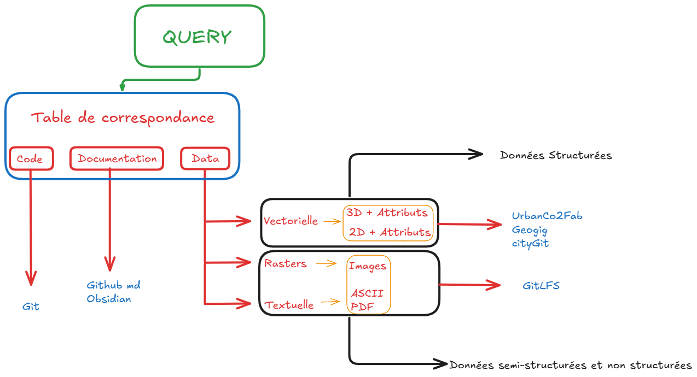

# Données, codes et connaissance pour une ville en évolution

> Arthur Villarroya-Palau, Mika Inisan, John Samuel, Gilles Gesquière

## Problèmatique
Au cours des dernières décennies, le concept de ville intelligente a gagné en popularité, devenant un objectif à la fois technologique et sociétal pour répondre aux défis de l'urbanisation moderne. À travers l’installation massive de capteurs (température, humidité, pollution, caméras, flux de population, etc.), l’usage de technologies de l’information et d’algorithmes prédictifs, les villes produisent aujourd’hui une quantité sans précédent de données. Ces données sont utilisées pour améliorer la gestion des ressources, optimiser les flux urbains, prévenir certains risques ou encore guider les politiques d’aménagement.

Ce processus a donné naissance à une multitude de projets générant des jeux de données hétérogènes, des algorithmes d’analyse, des modèles prédictifs, ainsi que des connaissances sous forme d’articles scientifiques, de rapports ou de visualisations. Toutefois, cette production massive se heurte à une difficulté majeure : l’absence d’un cadre permettant de relier, dans le temps et de manière cohérente, les données, les traitements appliqués, les connaissances produites, et surtout les conditions dans lesquelles ces éléments ont été générés (productions par différents projets).

Les limites des approches actuelles sont particulièrement visibles lorsqu’il s’agit de comprendre l’évolution d’une ville dans le temps. En effet, les villes sont des systèmes dynamiques, en constante transformation. Or, la plupart des outils d’analyse urbaine peinent à capturer cette dynamique, faute de mécanismes efficaces de suivi des versions, d’historicisation des transformations et d’intégration des contextes de production des données et connaissances.

Dans ce contexte, une question émerge :

Comment concevoir une méthode capable de suivre l’évolution urbaine sans dissocier les données, les algorithmes, le code, les connaissances produites ni l’enchaînement des étapes, des décisions et des contextes dans lesquels ces connaissances ont étés générées ?  L’objectif serait de regrouper tous les éléments liés au territoire de manière cohérente, traçable et versionnée, tout en permettant d’interroger à tout moment leur état, leur version, leur origine ou leur signification à travers le temps.

Un exemple concret avec une situation récente : lors d'une réunion, un problème majeur a été identifié. Une personne, chargé de développer une analyse de données urbaines, n’avait ni documenté son raisonnement, ni précisé les algorithmes employés, ni référencé les jeux de données utilisés. Cette absence d'information rendait impossible la compréhension, la vérification, la reproductabilité de son travail. Cet exemple illustre bien combien il est essentiel non seulement de versionner les données et les codes, mais aussi de documenter la   production de connaissances de manière structurée, traçable et interrogeable dans le temps.
Ce type de situation n’était pas isolé, mais révélait au contraire une problématique récurrente dans de nombreux projets : l'absence de suivi clair et de versionnement des différentes étapes de production des connaissances. Cette lacune rend difficile la compréhension, la vérification et la réutilisation des travaux réalisés. Elle souligne le besoin de mettre en place des outils ou des méthodes permettant une traçabilité complète, depuis le code initial jusqu’aux données utilisées, en incluant la documentation qui explique le tout pour chaque version.


## Plan du document

Ce document fait le point sur les différentes manières de gérer le versionnement dans un projet de recherche ou/et de développement.

La section sur le [versionnement du code source](#versionnement-du-code-source) présente les outils les plus utilisés, les modèles de branchement possibles et les bonnes pratiques pour garder un code clair, collaboratif et évolutif.

Le [versionnement de la documentation](#versionnement-de-la-documentation) aborde les liens entre documentation et code, les outils pour publier et structurer des documents versionnés, ainsi que les stratégies pour en suivre les évolutions.

Le [versionnement des données](#versionnement-des-données) traite des formats manipulés, des sources mobilisées et des méthodes de traitement ou de requêtage, en mettant l’accent sur la traçabilité.

La section sur la [visualisation des versions](#visualisation-des-versions) décrit différentes approches pour rendre visibles les changements, que ce soit sur du code, des fichiers, des données tabulaires, des modèles 3D ou des images raster.

Une [proposition d’approche pour le projet IA.rbre](#proposition-dapproche-pour-le-projet-iarbre) illustre concrètement ces principes à travers un cas d’usage sur la désimperméabilisation de la ville. On y détaille les choix d’outils, l’organisation du versionnement et l’application aux différentes composantes du projet.

Enfin, une [table de correspondance](#table-de-correspondance) est proposée pour relier entre elles les différentes versions du code, des données et de la documentation, et garantir une vue d’ensemble claire et interrogeable dans le temps.


## Versionnement du code source
Le versionnement du code source est sans doute l’un des domaines les plus aboutis en matière de gestion des versions. Depuis longtemps, les développeurs disposent d’outils puissants et de bonnes pratiques bien établies pour suivre l’évolution de leurs fichiers, travailler à plusieurs sans conflit, expérimenter de nouvelles idées sans risquer d’abîmer la version stable, ou encore de revenir facilement à un état antérieur du projet.

### Outils classiques

Les systèmes de gestion de versions comme [Git](https://git-scm.com/), [Mercurial](https://www.mercurial-scm.org/) ou [SVN](https://subversion.apache.org/) servent à garder une trace claire de toutes les modifications apportées à un fichier ou à un projet. À chaque changement, ils enregistrent qui a fait quoi, quand, et pourquoi, un peu comme un journal de bord. Git est devenu le standard le plus utilisé, notamment parce qu’il fonctionne de manière distribuée (chacun a sa propre copie complète du projet) et qu’il s’intègre très bien avec des plateformes de collaboration comme [GitHub](https://github.com/), [GitLab](https://about.gitlab.com/fr-fr/) ou [Bitbucket](https://bitbucket.org/product/). Cela rend le travail en équipe plus fluide, plus sûr et plus transparent.

Les systèmes de gestion de versions comme Git permettent de suivre précisément l’évolution d’un projet informatique. Chaque modification du code est enregistrée sous forme de "commit", avec un message descriptif, un auteur et une date, ce qui constitue un historique complet du développement. Le principe de branche permet de travailler sur plusieurs fonctionnalités en parallèle, sans interférer avec la version principale du projet. Lorsqu’une fonctionnalité est prête, elle peut être fusionnée dans la branche principale grâce à un mécanisme de "merge". Si plusieurs changements sont incompatibles, des conflits apparaissent et doivent être résolus manuellement. Ce fonctionnement facilite le travail en équipe, rend les évolutions du code traçables, et permet de revenir facilement à un état antérieur en cas d’erreur.

### Modèles de branchement

[Git Flow](https://git-flow.readthedocs.io/fr/latest/presentation.html) et [Trunk-Based Development](https://trunkbaseddevelopment.com/) sont deux façons d’organiser le travail avec Git. Git Flow utilise plusieurs branches avec des rôles bien précis : `main` pour les versions stables, `develop` pour le développement général, `feature` pour les nouvelles fonctionnalités, `release` pour préparer les versions à livrer, et `hotfix` pour corriger rapidement les bugs en production. Ce système permet de bien structurer le travail, surtout quand il y a plusieurs versions à gérer en même temps. Mais il peut devenir compliqué à suivre, surtout dans les grandes équipes. Trunk-Based Development, au contraire, est plus simple. Les développeurs travaillent presque tous sur une seule branche, appelée `main` ou `trunk`. Les changements sont petits, faits souvent, et ajoutés rapidement. Cela rend le développement plus fluide, mais demande aussi beaucoup d’attention pour éviter les erreurs ou les conflits dans le code. Le choix entre les deux dépend donc du rythme du projet et de la taille de l’équipe.

| Modèle                  | Points forts    | Limites    |
|------------------------|------------------------------------------------------|------------------------------------------------------|
| Git Flow               | Organisation claire, gestion de plusieurs versions   | Complexité, rigidité|
| Trunk-Based Development| Simplicité, rapidité| Moins structuré, nécessite une grande rigueur |

### Quelques éléments à prendre en compte

Dans le cadre du développement logiciel, une bonne gestion des versions et de l’historique du code est essentielle pour assurer la lisibilité, la traçabilité et la stabilité d’un projet. Git, en tant qu’outil de gestion de versions distribué, offre de nombreuses fonctionnalités puissantes, à condition d’en faire un usage rigoureux. Parmi les bonnes pratiques à adopter, on peut citer l’écriture de messages de commit clairs et explicites pour comprendre rapidement les modifications apportées, l’utilisation de tags pour identifier facilement les versions stables, l’adoption de la version sémantique (SemVer) pour structurer l’évolution du projet, et enfin, le recours au SWHID (Software Heritage Identifier) pour référencer de manière fiable et durable les éléments de code archivés. Ces pratiques contribuent à une gestion plus fluide, transparente et durable des projets collaboratifs.
Voici quelques bonnes pratiques à suivre lors de l'utilisation de Git, pour garantir une gestion fluide et claire de l'historique :

- Messages de commit clairs et précis : chaque message de commit doit décrire ce qui a été modifié et pourquoi, en évitant les termes vagues comme "update" ou "fix".
  
- Utilisation des tags pour marquer les versions : les tags sont utilisés pour marquer des versions spécifiques du projet. Cela permet de retrouver facilement une version stable.

- Version sémantique (SemVer) : appliquer la version sémantique sous la forme MAJOR.MINOR.PATCH pour indiquer la nature des changements. Cela permet de mieux comprendre si une nouvelle version est compatible, rétrocompatible, ou si elle brise des fonctionnalités existantes.

- Le [SWHID](https://docs.softwareheritage.org/devel/swh-model/persistent-identifiers.html) (Software Heritage Identifier) : est un identifiant unique qui permet de retrouver précisément un fichier, une version ou un dépôt de code archivé dans la bibliothèque Software Heritage. Il est basé sur le contenu lui-même (et non sur son emplacement) grâce à un hachage, ce qui garantit que le code référencé est exact et vérifiable. C’est un outil utile pour citer du code source de manière fiable et durable.


## Versionnement de la documentation
Le versionnement de la documentation est essentiel pour assurer la cohérence avec le code tout au long du projet. Il permet non seulement de comprendre et rejouer le code avec un enjeu de réplicabilité, mais aussi de reproduire les résultats obtenus avec un enjeu de reproductibilité. Il existe au moins trois types de documentation qu’il est important de mentioner vis à vis du versionnement : la documentation liée au code, que l'on peut générer automatiquement avec des outils tel que Doxygene, qui décrit les éléments techniques du code source (fonctions, classes, etc...) ; la documentation fonctionnelle et méta, qui explique ce que fait le code, pourquoi, dans quel contexte, avec des descriptions détaillées des objectifs, ou des choix de conception ; et enfin, la documentation utilisateur, comme un fichier README, qui guide les utilisateurs dans l’installation, la configuration et l’exécution du code.

### Intégration avec le code

La documentation suit une logique de versionnement proche de celle du code. La documentation peut donc être versionnée dans un dépot git parrallèle à celui du code, sous forme de fichier texte par exemple. 

### Systèmes de documentation versionnés
Des outils comme [GitHub Pages](https://pages.github.com/) ou des générateurs comme [MKDocs](https://www.mkdocs.org/), [Docusaurus](https://docusaurus.io/) ou [ReadTheDocs](https://about.readthedocs.com/?ref=app.readthedocs.com) permettent de transformer automatiquement cette documentation versionnée en sites web statiques ou de les stocker.
Le stockage d'un site web statique (HTML, CSS, JS) avec GitHub Pages peut permettre une facilité d'utilisation et d'obtenir faciliment les versions précédentes de la documentation en regardant les versions différentes du site. 
Les générateurs de sites web statiques comme MkDocs, Docusaurus ou Read the Docs permettent de transformer automatiquement une documentation structurée (souvent écrite en Markdown) en un site web clair et navigable. Ils affichent différentes versions de la documentation dans des menus déroulants ou des onglets, sans avoir à coder le site à la main. Une fois la documentation organisée et poussée dans un dépôt, ces outils gèrent la mise en page, le thème, la navigation, et la séparation propre entre versions. 


### Stratégies de gestion des versions documentaires

| Stratégie de versionnement | Descrition  |
| -----------| ------ |             
| Versionnement dans un dépôt Git parallèle   | La documentation est versionnée comme le code, dans un dépôt Git séparé ou intégré, généralement au format Markdown.                                                           |
| GitHub Pages                                 | Permet d’héberger un site web statique à partir d’un dépôt Git ; facilite l’accès aux différentes versions du site (et donc de la documentation) via les commits ou les tags.  |
| Générateurs de sites statiques (MkDocs, Docusaurus, Read the Docs) + git ou plug-in | Outils qui transforment automatiquement une documentation écrite en Markdown en site web navigable ; ils permettent d’afficher différentes versions via des menus ou onglets, sans avoir à coder manuellement le site. |

<small>Ce tableau présente plusieurs stratégies de versionnement appliquées à la documentation</small>

En conclusion de cette partie, pour bien gérer la documentation d’un projet, mieux vaut éviter les wikis comme celui de GitHub, souvent mal tenus et difficiles à versionner. L’idéal est de garder toute la documentation dans le dépôt Git, au format Markdown, pour qu’elle suive l’évolution du code.

Il faut aussi organiser cette documentation selon son type : une partie pour ce qui est lié au code (fonctions, classes…), une autre pour expliquer le fonctionnement général et les choix faits, et une dernière pour guider les utilisateurs (installation, usage, etc.).

Une fois cette base posée, on peut créer un vrai site web de documentation avec des outils comme MkDocs, Docusaurus ou Read the Docs. Ces outils permettent de naviguer facilement dans la doc et de gérer plusieurs versions.


## Versionnement des données

Le versionnement des données, qu'elles soient urbaines, scientifiques ou issues de contextes créatifs, consiste à organiser, suivre et interroger les évolutions successives d’un jeu de données. Il repose sur des formats variés, des sources multiples, des représentations structurées et des méthodes spécifiques de traitement et de requêtage.

### Types de données

Les données versionnées peuvent prendre des formes très variées selon les contextes. On distingue généralement plusieurs grands types :  
- **Données attributaires** (ou tabulaires), comme des tableaux de mesures ou des bases de données  
- **Données textuelles**, par exemple des descriptions, rapports ou extraits de documents   
- **Données vectorielles** en 2D ou 3D, qui représentent des géométries précises (points, lignes, polygones, volumes), souvent utilisées pour la cartographie ou la modélisation urbaine  
- **Données raster** (2D ou 3D), structurées en grilles de pixels ou de voxels, utilisées pour des images, des cartes ou des champs de valeurs (température, élévation, etc.)
- **Données image**, incluant photographies, plans scannés, captures satellite ou vues d’objets  


Dans le domaine géospatial, ces types peuvent être combinés : une image peut être géoréférencée (vue d’un bâtiment à une date précise), un texte peut faire référence à une zone (emprise foncière, parcelle), un permis de construire peut être lié à une géométrie vectorielle et à des documents annexes. Les données géographiques mêlent ainsi valeurs, formes et contextes, avec des liens explicites ou implicites entre les objets représentés et leur position dans l’espace ou dans le temps. Cette richesse rend le versionnement particulièrement important pour conserver les liens entre données, géométries, documents et évolutions.


### Formats de données
Le versionnement des données concerne une grande diversité de formats. On distingue généralement deux grandes familles. La première regroupe les formats structurés standards, tels que CSV, JSON ou XML, largement utilisés pour le traitement et l’analyse de données. La seconde inclut des formats spécialisés, adaptés à des usages particuliers comme la 3D (CityGML, OBJ, ect..), les graphes sémantiques (RDF, TTL, ect..) ou les contenus créatifs (SVG, ect..)

Les formats comme CSV, JSON ou XML sont largement utilisés pour les jeux de données classiques. Ils permettent de représenter des tableaux de données, des structures arborescentes ou des flux. Le versionnement porte alors sur les fichiers eux-mêmes ou sur leur contenu (modification de lignes/colonnes).

Les formats scientifiques tels que netCDF, HDF5 ou GeoTIFF sont optimisés pour des données multidimensionnelles (ex. séries temporelles, données environnementales). Dans l'article scientifique [Standardised Versioning of Datasets: a FAIR–compliant Proposal](https://www.nature.com/articles/s41597-024-03153-y) (González–Cebrián, 2024), les auteurs proposent un système de versionnage inspiré de semver (major.minor.patch), adapté aux données complexes.

Pour les données spatiales ou en 3D, des formats comme GML, CityGML ou IFC permettent de décrire en détails les objets urbains. Le format CityGML, par exemple, structure les bâtiments, la végétation ou le mobilier urbain avec des propriétés détaillées, y compris des informations temporelles. Il est utilisé dans des travaux comme Managing Versions and History Within Semantic 3D City Models ou [URBANCO2FAB](https://isprs-annals.copernicus.org/articles/IV-4-W6/65/2018/isprs-annals-IV-4-W6-65-2018.pdf) (Samuel, 2018), qui ajoutent des mécanismes de version similaires à ceux de Git pour suivre l’évolution des objets 3D dans le temps.

Le Shapefile, quant à lui, est un format SIG vectoriel très répandu, notamment dans les administrations publiques et les logiciels comme QGIS ou ArcGIS. Bien qu’il soit composé de plusieurs fichiers binaires (SHP, SHX, DBF…).

Pour les nuages de points, issus majoritairement de capteurs LiDAR ou de photogrammétrie, des formats comme LAS et LAZ sont utilisés. Ils permettent de stocker des millions de points géoréférencés dans l’espace 3D. L’article [A Version Control System for Point Clouds](https://www.mdpi.com/2072-4292/15/18/4635) (Ogayar-Anguita, 2023) propose un système de versionnement optimisé pour ce type de données, basé sur la détection et le stockage des différences entre versions plutôt que sur la duplication complète des fichiers. Ce système améliore la gestion de l’espace et la traçabilité dans les processus de traitement.

Pour les graphes de connaissances, le format RDF permet de modéliser les relations entre entités de façon claire. Les systèmes comme [ConVer-G](https://hal.science/hal-04690144/document) (Gil, J. P., 2024) et Quit Store utilisent des graphes nommés ou des bitstrings pour gérer de multiples versions.

Enfin, certains contextes mobilisent des formats de données non structurées (PDF, images, documents manuscrits, maquettes physiques), élargissant la notion de “version” à toute trace d’un état à un instant donné.

| Type de format        | Exemples                         | Usages principaux                           |
|-----------------------|----------------------------------|---------------------------------------------|
| Tabulaire             | CSV, TSV, Excel                  | Données classiques, statistiques            |
| Semi-structuré        | JSON, XML, YAML                  | Données API, logs, configurations           |
| Scientifique          | netCDF, HDF5, GeoTIFF            | Climat, environnement, imagerie             |
| 3D sémantique         | CityGML, IFC                     | Modélisation urbaine, architecture          |
Nuages de points	| LAS, LAZ	| Relevés 3D, LiDAR, photogrammétrie |
| SIG vectoriel | Shapefile, GeoPackage | Cartographie, données géospatiales |
| Graphe de connaissance| RDF, RDF Quad, TTL               | Ontologies, données liées, SPARQL           |
| Informel / créatif    | PDF, image, prototype physique   | Création, documentation, art/design         |

<small>Ce tableau présente différents types de formats de données, classés selon leur structure et leur usage. Chaque ligne associe un type de format à quelques exemples concrets, l'utilisation la plus courante de chaque format de donnée</small>

Au-delà du format des fichiers, les données sont souvent accompagnées de notices explicatives, qui détaillent comment elles ont été produites : méthode de collecte, traitements appliqués, sources utilisées, etc. On parle parfois de paradonnées pour désigner ces informations sur le contexte de fabrication des données. À cela s’ajoutent les métadonnées, qui décrivent des éléments plus standards comme la date, l’auteur, la licence, la résolution. Enfin, certaines données ont une structure complexe qui est définie par un schéma (comme un schéma XML ou RDF), essentiel pour bien les interpréter. Tous ces éléments doivent rester liés aux données, être versionnés avec elles, et accessibles facilement pour permettre leur bonne compréhension et réutilisation.

### Sources de données
Le versionnement repose sur la nature des sources. Il peut s'agir de données mesurées, collectées, simulées ou reconstruites.

Dans les domaines scientifiques, les sources classiques sont les capteurs (stations météo, satellites, LIDAR, etc), les simulations (modèles climatiques, flux de transport, etc), ou les enquêtes (INSEE, Eurostat, etc). Ces données sont souvent versionnées, chaque mise à jour ou recalcul des données, créé une nouvelle version. Un article  comme [Standardised Versioning of Datasets: a FAIR–compliant Proposal](https://www.nature.com/articles/s41597-024-03153-y) (González–Cebrián, 2024) soulignent l'importance de décrire clairement l'origine des données (qui les a produites, comment, quand), la version exacte à laquelle on se réfère, ainsi que des informations sur leur qualité (niveau de fiabilité, précision, éventuelles limites). Ces éléments sont essentiels pour permettre de comprendre, comparer et réutiliser les données de manière rigoureuse. 

Dans la modélisation urbaine, les sources historiques sont essentielles : permis de construire, cartes anciennes, photographies, plans d’urbanisme, etc. Des projets comme [URBANCO2FAB](https://isprs-annals.copernicus.org/articles/IV-4-W6/65/2018/isprs-annals-IV-4-W6-65-2018.pdf) (Samuel, 2018) utilisent ces documents pour recréer plusieurs versions d’un même endroit, en mêlant à la fois mémoire collective et archives.

Les données ouvertes comme par exemple les OpenStreetMap, cadastre, ou les données publiques sont à la fois utilisées pour représenter un état courant et pour détecter des évolutions.

Dans un contexte collaboratif, les données peuvent être produites par les utilisateurs avec par exempe des sondages. Dans l'article  [Decentralized Collaborative Knowledge Management using Git](https://arxiv.org/pdf/1805.03721) (Arndt, 2019), les auteurs montrent comment des connaissances distribuées peuvent être versionnées dans un graphe RDF.


| Type de source        | Exemples                                | Domaines concernés                  |
|-----------------------|------------------------------------------|--------------------------------------------|
| Capteurs              | Température, pollution, circulation, Lidar      | Environnement, transport, 3D            |
| Données simulées      | Modèles climatiques, prédictions         | Climat, urbanisme, santé            |
| Archives / historiques| Plans, photos, permis                    | Reconstitution d’états passés              | Patrimoine, modélisation 3D         |
| Données ouvertes      | OpenStreetMap, données INSEE             | États successifs d’un territoire           | Données publiques, SIG              |
| Données collaboratives| Contributions citoyennes, annotations   | Versions distribuées, multiples auteurs    | Science participative, design       |

<small>Ce tableau présente différents types de sources de données, avec des exemples concrets et les domaines dans lesquels elles sont le plus souvent utilisées. Il montre la diversité des origines possibles comme les capteurs, archives, contributions humaines ou simulations et leurs usages selon les contextes</small>

### Méthodes de traitement et de requêtage
Le versionnement de données ne consiste pas seulement à conserver des copies successives : il faut aussi pouvoir les comparer et comprendre ce qui a changé. Pour cela, différentes approches ont été développées, allant de l’adaptation d’outils existants à des solutions pensées pour des cas spécifiques.

### Outils adaptés au traitement des données

Git permet de suivre les changements dans les fichiers, y compris les jeux de données. Il facilite la traçabilité, la comparaison entre versions, et l’expérimentation via des branches. C’est une base simple mais efficace pour versionner des données, tant qu’elles ne sont pas trop volumineuses.

[LakeFS](https://lakefs.io/) permet de versionner directement des datasets volumineux dans des systèmes de fichiers distribués. Il prend en charge des workflows de traitement en ajoutant des commits après chaque transformation de données, rendant chaque étape reproductible. Les branches permettent d’expérimenter des traitements sans compromettre la version principale des données. Il a une version gratuite mais une grande partie des fonctionalités sont payantes.

D’autres outils répondent à des besoins plus spécifiques. [Git LFS](https://git-lfs.com/) (Large File Storage) permet de gérer des fichiers lourds (images, vidéos, etc...) en les stockant en dehors du dépôt Git, tout en gardant des pointeurs dans le versionnement. Il reste proche du fonctionnement de Git, mais reste un outil générique pour le versionnement de gros fichiers, mais il ne propose pas de fonctionnalités avancées pour des cas d’usage complexes.

[DVC](https://dvc.org/) (Data Version Control) est un outil OpenSource il est conçu pour les projets de science des données ou de machine learning. Il permet de versionner à la fois les données et les modèles entraînés tout en assurant un lien fort entre les données, le code et les résultats obtenus. Il offre ainsi une solution complète pour garantir la traçabilité et la reproductibilité des expérimentations.

[DoltHub](https://www.dolthub.com/) est une plateforme web basée sur Dolt, un moteur de base de données SQL qui intègre nativement le versionnement. Chaque modification dans une base (insertions, suppressions, mises à jour, etc...) est suivie comme un commit Git. On peut y créer des branches, fusionner des changements ou comparer différentes versions d’une base SQL, avec une traçabilité fine et collaborative.

Pour les jeux de données géospatiaux, des outils dérivés de Git ont été spécifiquement conçus pour gérer les particularités des formats spatiaux. [GeoGig](https://geogig.org/) applique les concepts de Git aux bases de données spatiales, en versionnant finement les objets géographiques (points, lignes, polygones) et leurs attributs, avec un support natif pour des SGBD comme PostGIS, et des opérations telles que commit, merge ou diff. [Kart](https://kartproject.org/), plus récent, reprend également les principes de Git, mais avec une interface plus moderne et une meilleure intégration aux outils SIG. Il supporte une large gamme de formats vectoriels comme Shapefile, GeoPackage, PostGIS et GeoJSON, et permet aussi d’intégrer des raster. Kart propose des diffs sémantiques entre versions, une gestion des métadonnées claire, et s’intègre dans des workflows collaboratifs via la CLI ou QGIS. Ces outils sont particulièrement adaptés aux projets de cartographie collaborative, d’aménagement ou de suivi de l’évolution spatiale.

Les méthodes de calcul de dérive, telles que l’analyse en composantes principales (PCA) et les autoencodeurs, sont utilisées dans l’article [Standardised Versioning of Datasets](https://www.nature.com/articles/s41597-024-03153-y) (González–Cebrián, 2024) pour mesurer les différences entre deux versions d’un même jeu de données. Elles permettent de quantifier les changements réels dans les structures ou les valeurs des données, offrant ainsi une base objective pour justifier le passage à une nouvelle version. Ces outils sont particulièrement utiles dans un cadre FAIR (Findable, Accessible, Interoperable, Reusable), où la traçabilité et la reproductibilité sont essentielles, notamment pour les données complexes comme les séries temporelles, les jeux raster ou environnementaux.

### Approches issues de la recherche
Certains projets de recherche ont développé des outils sur mesure pour répondre à des besoins spécifiques de versionnement.

[URBANCO2FAB](https://isprs-annals.copernicus.org/articles/IV-4-W6/65/2018/isprs-annals-IV-4-W6-65-2018.pdf) (Samuel, 2018) propose une adaptation des principes de Git aux objets urbains 3D. Chaque évolution d’un bâtiment ou d’un espace est enregistrée comme un commit, avec des métadonnées associées. Cela permet de reconstruire l’histoire d’un quartier ou de comparer différentes hypothèses d’aménagement à travers le temps.

L’article [A Version Control System for Point Clouds](https://www.mdpi.com/2072-4292/15/18/4635) (Ogayar-Anguita, 2023) présente un système spécialement conçu pour versionner efficacement les nuages de points. Plutôt que de dupliquer les fichiers à chaque modification, le système stocke uniquement les ajouts, suppressions et modifications de points sous forme de deltas. Cela permet de garder un historique des traitements tout en optimisant l’espace disque. Le système propose également des opérations de commit, undo, redo, et peut gérer à la fois des modifications manuelles et automatiques. Ce type d’approche est essentiel pour des projets de longue durée où les relevés 3D sont ajustés, nettoyés ou enrichis progressivement.

[Quit Store](https://github.com/AKSW/QuitStore) applique ces principes au monde des graphes RDF. Il permet de suivre les évolutions d’un graphe de connaissance en gardant une trace de chaque ajout, suppression ou modification de triplet. Des opérations comme les merges, les diff ou les requêtes par version deviennent possibles, facilitant la collaboration et la traçabilité.

[ConVer-G](https://hal.science/hal-04690144/document) (Gil, 2024) pousse encore plus loin cette logique en optimisant les requêtes sur des graphes RDF versionnés. Il permet d’interroger plusieurs versions d’un graphe en même temps, grâce à un index structuré. Cela évite de recharger chaque version à la main et rend les analyses temporelles ou comparatives plus efficaces.

Enfin, certaines démarches ethnographiques (interviews, récits d’usage, etc) permettent de mieux comprendre les pratiques de versionnement dans des environnements non techniques. C'est à dire être capable de raconter un récit grâce à des données non virtuelles, et être capable de visualiser et d'interpreter les versions de ce même récit. Ces méthodes sont particulièrement utiles lorsqu’il s’agit de versions physiques, sociales ou narratives d’un même lieu ou objet.
 

| Méthode                   | Exemples / outils                  | Fonction                             | Domaines                              |
|---------------------------|------------------------------------|--------------------------------------|----------------------------------------|
| Git / Pygit2              | URBANCO2FAB(Samuel, 2018), Quit Store            | Suivi, commit, branches              | Urbanisme, RDF collaboratif            |
Versionnement de nuages de points	| Version Control System for Point Clouds (Ogayar-Anguita, 2023) |	Stockage différentiel, suivi fin |	Patrimoine, architecture, Relevés LiDAR |
| Git LFS                   | GitHub LFS                         | Suivi de fichiers lourds             | Code, multimédia, imagerie             |
| DVC                       | Data Version Control               | Versionnement de données et modèles  | Science des données, machine learning  |
| LakeFS                    | LakeFS                             | Contrôle de version dans les data lakes | Données massives, pipelines analytiques |
| Dolt / DoltHub            | DoltHub                            | Versionnement de bases SQL           | Données tabulaires, data engineering   |
| GeoGig / Kart | GeoGig, Kart | Versionnement de données géospatiales vectorielles et raster, diff | SIG, cartographie, urbanisme |
| Analyse de dérive         | PCA                                | Détection de changement              | Science, imagerie, séries temporelles  |             
| Requêtes SPARQL versionnées| Conver-G(Gil, J. P., 2024)                           | Interrogation multi-versions         | Données liées, graphe RDF              |
| Ontologies et logique     | OWL, description logique           | Cohérence sémantique des versions    | Données complexes, 3D sémantique       |
| Méthodes qualitatives     | Entretiens, journaux, logs         | Compréhension des usages             | Design, création, recherche UX         |

<small>Ce tableau présente différentes méthodes de versionnement et d’analyse du changement, avec des exemples d’outils, leur fonction principale et les domaines où elles sont le plus utilisées</small>

## Versionnement de WorkFlow
Versionner un workflow, c’est bien plus que garder une trace d’un fichier ou d’un script. C’est suivre l’évolution d’un processus complet : quelles étapes sont enchaînées, dans quel ordre, avec quels outils et quelles données. Mais cette logique pose vite des questions. À partir de quand peut-on dire qu’un workflow a réellement changé ? Est-ce qu’un changement mineur dans un paramètre, ou dans la façon d’écrire une étape, suffit à créer une nouvelle version ? Ou faut-il attendre qu’un nouveau résultat ou une structure différente apparaisse pour parler de "version" ?

Avec des systèmes comme [Argo Workflows](https://argoproj.github.io/workflows/), les workflows sont décrits dans des fichiers YAML. Cela a l’avantage d’être clair et lisible, mais cela peut aussi induire en erreur : un fichier peut être modifié sans que le processus qu’il décrit ne change réellement. Inversement, deux fichiers différents peuvent produire exactement le même enchaînement d’actions. Et avec des outils comme [Hera](https://github.com/argoproj-labs/hera), qui permettent d’écrire ces YAML via un script Python, une nouvelle couche de complexité s’ajoute : on peut modifier le code Python sans que cela ne change le workflow généré. Cela complique la manière dont on définit une "vraie" nouvelle version.

Autrement dit, versionner un workflow, ce n’est pas seulement suivre les changements dans les fichiers. C’est surtout suivre l’intention, la logique et le comportement du processus lui-même. Ce qui demande parfois de sortir des outils classiques du versionnement pour mieux comprendre ce qu’on cherche à conserver.

## Visualisation des versions

Après avoir exploré les différentes modalités de versionnement appliquées au code, à la documentation et aux données, il est essentiel d’examiner comment ces versions peuvent être visualisées, comparées et interprétées.

La visualisation met en évidence les différences entre versions ou leur temporalité. Elle peut s’appliquer :
- aux fichiers (diff de code, visualisation de texte, surlignage des changements, etc...) 
- aux données structurées (visualisation de tableaux, de JSON, de graphes, etc...) 
- aux objets spatiaux ou 3D (colorisation des parties modifiées, encodage temporel, empilement de géométries, etc...) 
- aux processus de transformation eux-mêmes (arbres de transitions, timelines de commits, historiques narratifs, etc...)

### Outils de visualisation classiques (code, fichiers, texte)
Les outils comme GitKraken, Git Graph, ou GitHub Desktop permettent de visualiser les modifications apportées localement sur le repository, les branches, les commits et les fusions dans un référentiel Git. Ils donnent accès à une vue arborescente ou linéaire de l’évolution du code source, avec des fonctions de recherche, de comparaison entre versions et d’annotation.

Pour les fichiers textuels, les interfaces de diff intégrées dans GitHub affichent les lignes ajoutées, supprimées ou modifiées, facilitant la relecture et la revue de code.

### Visualisation des versions de documentation
La documentation peut être versionnée via Git au même titre que le code, mais elle requiert des outils adaptés à sa nature textuelle et à ses formats de publication.
Les générateurs de documentation comme MkDocs, Docusaurus ou Read the Docs peuvent intégrer la gestion de différentes versions via des structures de dossiers (par exemple, /v1/, /v2/) ou via des métadonnées (tags Git, interface web, etc...).

### Visualisation des versions de données
Pour les données structurées, des outils spécialisés permettent de visualiser les différences entre deux versions d’un jeu de données. Par exemple :

- DVC (Data Version Control) et Git LFS permettent de gérer des versions volumineuses de fichiers de données, et fournissent des tableaux de bord ou des métadonnées pour retracer les changements 
- DoltHub permet de comparer des bases de données tabulaires comme des fichiers Git, avec des vues diff et des historiques de commit 
- LakeFS intègre des visualisations temporelles ou graphiques (heatmaps, histogrammes, timelines, etc...) pour suivre les évolutions de datasets
- Kart ou GeoGig permette de faire des diff sur chaque commit sur les données géospatiales de la même manière que git. 

Certaines plateformes combinent visualisation et exploration interactive, par exemple sous forme de notebooks Jupyter historisés ou de dashboards avec versions annotées.

### Visualisation spatio-temporelle et 3D
Dans les données urbaines ou spatiales, des projets comme [URBANCO2FAB](https://isprs-annals.copernicus.org/articles/IV-4-W6/65/2018/isprs-annals-IV-4-W6-65-2018.pdf) (Samuel, 2018) ou Managing Versions in CityGML utilisent des visualisations 3D enrichies pour représenter l’évolution d’un quartier, d’un bâtiment ou d’un objet. Cela inclut:

- la superposition de géométries selon les versions 
- l’encodage couleur pour signaler les éléments modifiés 
- des timelines interactives pour naviguer dans les états successifs 
- des graphes orientés représentant les transitions (ajout, suppression, modification, etc...)
- visualisation d'un batiment unique et de ses détails

Dans le cas des nuages de points, la visualisation des versions peut se faire par rechargement d’états successifs dans un logiciel comme [CloudCompare](https://www.danielgm.net/cc/), ou par comparaison visuelle directe de deux versions (affichage différentiel, superposition, animation temporelle). Cela permet de repérer rapidement les évolutions et d’analyser les décisions prises à chaque étape.

### Visualisation des versions d’images et de données raster

Contrairement aux fichiers texte ou aux données tabulaires, il n’existe pas de solution largement adoptée pour visualiser directement le versionnement des images ou des données raster (comme l’imagerie satellite). Cependant, plusieurs outils permettent de versionner ces fichiers comme dit précédemment :

- **Git** peut être utilisé pour des images légères, mais il est peu adapté aux fichiers volumineux.
- **Git LFS (Large File Storage)** permet de suivre les changements sur des fichiers lourds, notamment des images ou des rasters.
- **DVC (Data Version Control)** est adapté aux pipelines de données incluant des images. Il permet de versionner des datasets complets, de suivre les évolutions des fichiers et de les relier à des étapes de traitement ou de modélisation.
- **Kart** peut être intégré à QGIS, ce qui permet une visualisation directe des différences entre versions via des styles ou des couches différentielles.

Ces outils permettent de suivre les versions, mais ne proposent pas de visualisation directe des différences entre deux images.

Pour cela, d’autres approches sont utilisées. Des outils en ligne comme DiffChecker ou des bibliothèques telles que permettent de visualiser les différences entre deux images.
En télédétection, certaines méthodes plus avancées permettent de détecter automatiquement les changements entre deux images prises à des dates différentes.  
Un exemple notable décrit dans l'article [Unsupervised Change Detection in Satellite ImagesUsing Principal Component Analysis and k-Means Clustering](https://d1wqtxts1xzle7.cloudfront.net/88046593/lgrs.2009.202505920220628-1-1fs6yld-libre.pdf?1656411525=&response-content-disposition=inline%3B+filename%3DUnsupervised_Change_Detection_in_Satelli.pdf&Expires=1748254957&Signature=RZfcTPP4ja5kzV3hVlL7oMT-oIx~JEoZsKfQWT57FCVoEtOfmFAccOJT6a1hDQJGTzvuBQan3kEqWfllJ5wfUgw8K2qgIQEONwl4EYyr6-TrcgZJW-sujgmo5jDuobSFnC4K5dmJ1ISNd0tmSJndm7ydJY4-QKxvLCKhXWYU3Vl4M2ICTYKB0A5JpHG2YwJMDRTOqsaXzgaGbFRHymS5fHCNGb9PM4uA6lUYg-2q2tTgQQjY7trjTdMRfXFSY1qSzhqo1cyJFK-D7ylqV9iy3EHQjrKcCS9gSexgjxPsnnEFLs3qbF3kM4g4V057BaIwi2yOBXxk46o1J6CN8gGCRA__&Key-Pair-Id=APKAJLOHF5GGSLRBV4ZA) (Celik, 2009) est une méthode non supervisée basée sur l’analyse en composantes principales (PCA) et le clustering par k-means.

| Type de visualisation         | Outils / approches                          | Contenus visés                        | Fonctions principales                         |
|------------------------------|---------------------------------------------|---------------------------------------|-----------------------------------------------|
| Arbre de versions            | G   itKraken, Git Graph, SourceTree            | Code source, configuration            | Navigation, comparaison, suivi des branches   |
| Diff textuel                 | GitHub, GitLab, VS Code      | Textes, Markdown, YAML, JSON          | Affichage des lignes modifiées                |
| Documentation versionnée     | MkDocs, Docusaurus, GitBook, Read the Docs  | Documentation technique               | Sélecteur de version, navigation historique   |
| Tableaux / SQL   | Dolt                        | Datasets tabulaires                   | Comparaison ligne/cellule, vues temporelles   |
| Versionnement de données voluminsue et modèle de ML    | DVC, LakeFS                                  | Fichiers de données, datasets volumineux | Tableaux de bord, historique de versions, suivi des changements |
| Visualisation 3D temporelle  | URBANCO2FAB (Samuel, 2018), CityGML extensions             | Objets urbains, modèles 3D            | Superposition, encodage couleur, timeline     |
| Versionnement géospatial | Kart, GeoGig | Données géospatiales vectorielles et raster | Diff géométrique, historique spatial, intégration SIG |
| Détection de changement dans une image | PCA + k-means (Celik, 2009), DiffHecer                    | Imagerie satellite multitemporelle, images simples  | Segmentation binaire, carte de changement, visualisation de différence           |

<small>Ce tableau recense différents types de visualisations utilisées pour explorer et comprendre les évolutions dans le temps. Il associe à chaque type des outils ou approches courants, les types de contenus concernés et les fonctions principales</small>

## Proposition d’approche pour le Projet IA.rbre

Pour structurer efficacement un projet exploitant une multitude de données urbaines, il est important d'organiser une organisation du projet autour du versionnement de code, de la documentation et des données.

### Cas d’usage représentatif – Désimperméabilisation de la ville

Ce projet a pour objectif d’identifier les surfaces imperméables à reconvertir (espaces verts, revêtements poreux) afin de favoriser l'infiltration des eaux pluviales. Il mobilise des données hétérogènes comme des données sur l'occupation du sol, des réseaux d’assainissement, des images satellites, des données topographique, ect... 

### Choix des outils adaptés à chaque composant du projet

#### Organisation du versionnement

L’article [Standardised Versioning of Datasets: a FAIR–compliant Proposal](https://www.nature.com/articles/s41597-024-03153-y) (González–Cebrián, 2024) propose une manière simple et claire de versionner les jeux de données, en s’inspirant du modèle major.minor.patch utilisé dans le développement logiciel. Ce modèle peut être très utile pour structurer l’évolution de nos données tout au long du projet.

- La partie **major** correspondrait à un changement important : par exemple une modification du format de données, du schéma, ou du système de coordonnées dans nos modèles 3D. Ce type de mise à jour impliquerait généralement une adaptation du code et de la documentation associés.
- La version **minor** serait utilisée pour signaler un enrichissement ou une mise à jour du contenu, sans changement de structure. L’article propose d’utiliser un **indice de dérive** (comme dE,PCA, basé sur une analyse en composantes principales) pour objectiver ce changement. 
- Enfin, **patch** serait réservé aux petites corrections (valeurs erronées, ajustements mineurs) et identifié simplement par une date.

Adopter ce modèle de versionnement nous permettrait de mieux documenter nos choix, de renforcer la traçabilité dans le temps, et de faciliter la reproduction ou l’évolution future du projet.


#### Code
Le versionnement du code pourrait reposer sur l’utilisation de Git, afin de suivre précisément l’évolution des scripts et des analyses. Le projet gagnerait à être organisé autour de branches thématiques c'est à dire une branche par tâche à réaliser. Une telle organisation faciliterait le travail en parallèle ainsi que la gestion des différentes idées ou hypothèses. Lorsqu’une version du projet serait jugée stable (par exemple pour produire un livrable ou un prototype), elle pourrait être marquée à l’aide de tags, ce qui permettrait d’y revenir facilement.

#### Documentation
La documentation pourrait être rédigée en Markdown, un format léger et aisément versionnable. Elle serait idéalement stockée dans le même dépôt Git que le code, garantissant ainsi une parfaite synchronisation entre les outils utilisés et leur description. Pour une diffusion claire et interactive, l’utilisation de MkDocs ou Docusaurus pourrait être envisagée : cet outil transformerait automatiquement les fichiers Markdown en site web. Cela permettrait à l’ensemble de l’équipe – voire aux partenaires extérieurs – d’accéder à une documentation claire, bien structurée et toujours à jour.

#### Données
Pour un projet manipulant des données urbaines en grande quantité, notamment raster, vectorielles et 3D (comme en CityGML), plusieurs outils open source peuvent être mobilisés.

DVC peut être une bonne solution si vous travaillez avec de gros fichiers comme des orthophotos, des modèles 3D ou des données SIG. Il permet de suivre les changements dans les fichiers, de relier les données aux traitements réalisés, et de garder une trace claire de l’évolution du projet.

Kart est particulièrement adapté pour les données géospatiales, qu’elles soient vectorielles ou raster. Inspiré de Git, il permet de suivre les modifications, de collaborer à plusieurs et de visualiser les différences entre versions. Il fonctionne bien avec des formats courants comme GeoPackage et peut s’utiliser directement dans des logiciels SIG comme QGIS.

Pour modèles 3D complexes, comme des bâtiments en CityGML, des approches comme celle du projet URBANCO2FAB, qui applique les principes de Git (commits, branches, comparaisons) à des objets géométriques et sémantiques, permet de bien visualiser comment les bâtiments ou les quartiers évoluent dans le temps.

Enfin, LakeFS peut être une bonne option si vous gérez un grand nombre de jeux de données dans un environnement de type "data lake". Il permet de gérer les versions de façon fine, mais demande une installation un peu plus complexe, et certaines fonctions avancées ne sont disponibles que dans la version payante.

#### Visualisation

Pour un projet intégrant du code, de la documentation et des données, plusieurs solutions de visualisation peuvent être combinées. GitHub, GitKraken ou Git Graph permettent d’explorer efficacement les versions du code source et de la documentation, avec visualisation des branches, commits et différences textuelles. 

Pour les données, DVC offre un suivi structuré des évolutions avec tableaux de bord et métadonnées, tandis que Dolt permet de visualiser les changements dans une base SQL comme dans Git. 

Dans le cas de données urbaines 3D (CityGML), des approches comme celles utilisées dans [URBANCO2FAB](https://isprs-annals.copernicus.org/articles/IV-4-W6/65/2018/isprs-annals-IV-4-W6-65-2018.pdf) (Samuel, 2018) avec de la superposition de géométries, de l'encodage couleur ou de la navigation temporelle, permettent de comparer visuellement l’évolution d’un bâtiment ou d’un quartier. Ces solutions, adaptées chacune à un type de contenu, facilitent une lecture croisée des versions à différentes échelles du projet.

### Avantages, limites et effort de mise en place

Mettre en place une telle organisation présente de nombreux avantages. On bénéficie d’une traçabilité complète des données, du code et des résultats, ce qui rend les projets plus robustes et reproductibles. Cela facilite aussi la collaboration et la compréhension entre les partenaires en rendant chaque composant du projet accessible et compréhensible.

Cette façon de faire a aussi quelques contraintes. Il faut un peu de temps au début pour installer les bons outils, bien organiser le projet et former les personnes. Pour ceux qui ne connaissent pas encore Git, LakeFS ou MkDocs par exemple, cela peut sembler compliqué au départ. Et ensuite, il faut rester rigoureux pour que tout reste bien en ordre.

## Table de correspondance
Une idée à explorer pour améliorer le suivi et la reproductibilité d'un projet serait de mettre en place une table de correspondance entre les différentes versions du code, des données, de la documentation et des résultats. Elle pourrait prendre la forme d’une table relationnelle, qui associe pour chaque étape du projet les fichiers utilisés, les versions des jeux de données, les scripts mobilisés, et les livrables produits. Ce n’est pas la seule solution possible, mais cela permettrait de garder une trace claire de ce qui a été fait, quand, et avec quoi.

Cette table pourrait s’appuyer sur des tags de versionnement (v1.0.0, v2.0.1, etc...), accompagnés de dates et de commentaires décrivant les changements apportés. L’idée serait de pouvoir revenir à une version précise du projet, de la comprendre, ou de la réutiliser sans problèmes.

Dans des projets complexes, comme ceux liés à l’évolution urbaine, où les données sont multiples, les méthodes évolutives, et les résultats souvent liés à des choix précis, ce genre de suivi pourrait faire la différence. Il aiderait à ne pas perdre le lien entre les éléments, à mieux documenter les décisions, et à rendre les travaux plus reproductibles.

Ce n’est pas une méthode figée et définie, mais plutôt une direction à tester et à explorer afin de trouver une réelle méthode permettant de rendre tout projet reproductible et réplicable. 



Voici un exemple d'organisation de projet vis à vis des outils à utiliser dans le cadre du versionnement de données urbaines avec le code, la documentation et la table de correspondance qui les mets en relation. 

Une fois la table de correspondance en place, on peut y faire des requêtes (Querys) pour retrouver des informations précises sur l’évolution du projet. Les requêtes simples permettent par exemple d’identifier toutes les versions où une certaine donnée a été utilisée, ou de lister les livrables produits avec un même script. Les requêtes agrégatives, elles, servent à résumer ou croiser des informations : compter combien de fois un jeu de données a été modifié, ou combien de versions du code ont été utilisées pour un même résultat. Ces deux types de requêtes permettent d’exploiter la table efficacement, sans la rendre plus complexe.

### Dans le cadre D'IA.rbre

Dans le cadre d'IA.rbre une table de correspondance peut s'avérer utile vis à vis de l'utilisation de nombreuse données (data.grandlyon, secteru privé), de leurs différentes versions, du changement de documentation induit par la modification de code et de donnnées. 
On peut imaginer la mise en place de la table de correspondance via un fichier JSON qui a pour chaque version générale du projet (un changement du code, des données, des meta données, de la documentation, ect...) comme une entrée dans un tableau, où chaque entrée contient les versions utilisées pour les données, le code, la documentation, voire les résultats produits.

```{
  "correspondances": [
    {
      "id": "T1",
      "date": "2024-11-01",
      "description": "Version initiale du projet",
      "donnees": "v1.3",
      "code": "v3.0",
      "documentation": "v1.2",
      "metadonnees": "v1.2",
      "resultat": "modele_3D_ville_v1"
    },
    {
      "id": "T2",
      "date": "2024-12-15",
      "description": "Mise à jour des données urbaines, ajustement du code",
      "donnees": "v1.4",
      "code": "v3.1",
      "documentation": "v1.3",
      "metadonnees": "v1.2",
      "resultat": "modele_3D_ville_v2"
    }
  ]
}
```

## Conclusion
Le versionnement, c’est avant tout une manière de garder une trace claire de ce que l’on fait dans un projet. Que ce soit pour le code, les données ou la documentation, tout évolue avec le temps. Et dans un projet un peu complexe, on peut vite se perdre : quelle version de données a été utilisée avec quel script ? Est-ce que la documentation correspond vraiment à ce qui a été fait ? Est-ce qu’on peut rejouer une étape du projet des mois plus tard, sans devoir tout redécouvrir ?

Dans ce document, on a exploré différentes façons de gérer ces évolutions : des outils connus (comme Git, DVC, ReadTheDocs ou Kart), des approches issues de la recherche, et surtout l’idée d’une table de correspondance. Cette table permet de faire le lien entre les versions du code, des données, des documents et des résultats. C’est un outil simple, mais puissant, pour retrouver le fil du projet, comprendre ce qui a été fait, et pouvoir le refaire si besoin.

Dans un projet comme IA.rbre, où les sources de données sont nombreuses, où les traitements évoluent, et où la documentation est essentielle, cette approche peut vraiment faire la différence. Elle aide à travailler plus proprement, à mieux collaborer, et à éviter de perdre du temps à chercher ce qui a déjà été fait.

En résumé, versionner, ce n’est pas juste garder des fichiers : c’est organiser la mémoire du projet, pour que chaque étape reste compréhensible, réutilisable et réplicable.
## Références

1. Mota, R., Ferreira, N., Silva, J. D., Horga, M., Lage, M., Ceferino, L., ... & Miranda, F. (2022). **A comparison of spatiotemporal visualizations for 3D urban analytics.** IEEE transactions on visualization and computer graphics, 29(1), 1277-1287. [PDF](https://www.evl.uic.edu/documents/3d_urban_analytics_ieeevis22.pdf)

2. Miranda, F., Ortner, T., Moreira, G., Hosseini, M., Vuckovic, M., Biljecki, F., ... & Ferreira, N. (2024, June). **The state of the art in visual analytics for 3D urban data.** In Computer Graphics Forum (Vol. 43, No. 3, p. e15112). [PDF](https://filipbiljecki.com/publications/2024_cgf_star_3dviz.pdf)

3. Veide, Z., Strozheva, V., & Dobelis, M. (2008, November). **3D Urban Landscape Visualization.** In SIGRAD 2008. The Annual SIGRAD Conference Special Theme: Interaction; November 27-28; 2008 Stockholm; Sweden (No. 034, pp. 83-84). Linköping University Electronic Press. [PDF](https://ep.liu.se/ecp/034/020/ecp083420.pdf)

4. González–Cebrián, A., Bradford, M., Chis, A. E., & González–Vélez, H. (2024). **Standardised versioning of datasets: a FAIR–compliant proposal.** Scientific Data, 11(1), 358. [PDF](https://www.nature.com/articles/s41597-024-03153-y)

5. Sterman, S., Nicholas, M. J., & Paulos, E. (2022). **Towards Creative Version Control.** Proceedings of the ACM on Human-Computer Interaction, 6(CSCW2), 1-25. [PDF]([https://ssterman.web.illinois.edu/assets/pdfs/towards_creative_version_control.pdf](https://ssterman.web.illinois.edu/assets/pdfs/towards_creative_version_control.pdf))

6. Klump, J., Wyborn, L., Wu, M., Martin, J., Downs, R. R., & Asmi, A. (2021). **Versioning data is about more than revisions: A conceptual framework and proposed principles.** Data Science Journal, 20(1), 12. [PDF](https://datascience.codata.org/articles/10.5334/dsj-2021-012)

7. Chaturvedi, K., Smyth, C. S., Gesquière, G., Kutzner, T., & Kolbe, T. H. (2017). **Managing versions and history within semantic 3D city models for the next generation of CityGML.** Advances in 3D geoinformation, 191-206. [PDF](https://hal.science/hal-01386247/document) 

8. Samuel, J., Servigne, S., & Gesquiere, G. (2018). **UrbanCo2Fab: Comprehension of concurrent viewpoints of urban fabric based on GIT.** ISPRS Annals of the Photogrammetry, Remote Sensing and Spatial Information Sciences, 4, 65-72. [PDF](https://isprs-annals.copernicus.org/articles/IV-4-W6/65/2018/isprs-annals-IV-4-W6-65-2018.pdf) 

9. Samuel, J., Servigne, S., & Gesquière, G. (2020). **Representation of concurrent points of view of urban changes for city models.** Journal of Geographical Systems, 22(3), 335-359. [PDF](https://hal.science/hal-02454953/document) 

10. GIL, J. P., Coquery, E., Samuel, J., & Gesquière, G. (2023, October). **Versionnement de graphe pour des données urbaines évolutives.** In BDA 2023. [PDF](https://hal.science/hal-04257528/document)

11. Gil, J. P., Coquery, E., Samuel, J., & Gesquière, G. (2024). **ConVer-G: Concurrent versioning of knowledge graphs.** arXiv preprint arXiv:2409.04499. [PDF](https://hal.science/hal-04690144/document) 

12. Arndt, N., & Martin, M. (2019, May). **Decentralized collaborative knowledge management using git.** In Companion Proceedings of The 2019 World Wide Web Conference (pp. 952-953). [PDF](https://arxiv.org/pdf/1805.03721)

13. Celik, T. (2009). **Unsupervised change detection in satellite images using principal component analysis and $ k $-means clustering.** IEEE geoscience and remote sensing letters, 6(4), 772-776. [PDF](https://d1wqtxts1xzle7.cloudfront.net/88046593/lgrs.2009.202505920220628-1-1fs6yld-libre.pdf?1656411525=&response-content-disposition=inline%3B+filename%3DUnsupervised_Change_Detection_in_Satelli.pdf&Expires=1750262357&Signature=L~SW2pACKvVADKoMaj8t~qq9Trg-ibHKzf0lNTMzeqHtPBNpN~ZCjwWq9rvCwgNlot4dIZ7j3AbAK7QYMdfyCp1FO9pDIC8YpPyJIFYQsm8s3N35Ea34M6MaVl-rbWtemWSulsQ1vdrjIxviuskfGNeV9KDsm3eNFJInXeOrPziLM9OEGde1bK4JufEojeFwEJFH4KX4fjAoJ4n2I3AMYtuiwFnXZummO~daSZh-LEdhacl4u1~1jtVQGoTMTNihIaZNAE9XTcdFiQSknb-uM1qacOtENKYme14S~LEPz-awcrigIdPCokQRL20TWuRHMC5tVE6WqHqvaImjTUYVAw__&Key-Pair-Id=APKAJLOHF5GGSLRBV4ZA)

14. Ogayar-Anguita, C. J., López-Ruiz, A., Segura-Sánchez, R. J., & Rueda-Ruiz, A. J. (2023). **A version control system for point clouds.** Remote Sensing, 15(18), 4635. [PDF](https://www.mdpi.com/2072-4292/15/18/4635)

## Blogs
- [Data Versioning Explained: Guide, Examples & Best Practices](https://lakefs.io/blog/data-versioning/)
