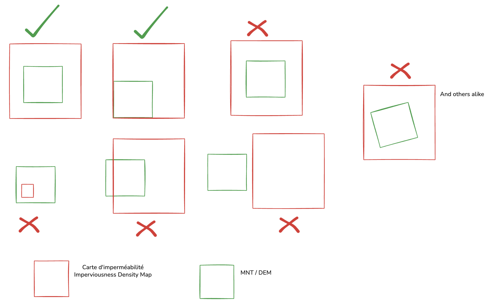

# README

## Description

This project aims to provide a tool for processing and analyzing geospatial data to generate usable Shapefile (.shp) files using either the "casier" (grid) method or the Beven-Kirkby Index (IBK) / Topographical Wetness Index (TWI) method.

Here is an overview of the main features:

- **lecture.py**: This file contains the necessary functions to read and interpret input data, such as DEM (Digital Elevation Model) files and the imperviousness file, both of which are raster files in .tif format.

- **methode.py**: This file implements the various calculation methods used to analyze the data, including grid segmentation algorithms and slope calculations.

- **visualisation.py**: This file provides functions to visualize intermediate and final results, making it easier to interpret the processed data.

- **main.py**: This file is the main entry point of the project. It orchestrates the execution of the different steps based on the parameters provided by the user.

## Installation

To run the code, make sure you have the following installed:

- Python 3.8 or higher

To run the following commands (and this program), first navigate to the `desealing` directory using the following **bash** command:

```bash
cd Path/to/the/desealing/folder
```

It is recommended to create a Python virtual environment before installing the dependencies if you are not already in one. To do this, run in **bash**:

```bash
python3 -m venv venv_name
```

To activate the virtual environment:

- **On macOS/Linux (Unix):**

    ```bash
    source .venv/bin/activate
    ```

- **On Windows:**

    ```cmd
    .venv\Scripts\activate
    ```

Then, install the dependencies with the following **bash** command:

```bash
pip install -r requirements.txt
```

## Prerequisites

This program requires a number of input data files to perform the desired analyses:

- A Digital Elevation Model (DEM) in GeoTIFF raster format (.tif)
  - [RGE ALTI (1m or 5m)]([https://geoservices.ign.fr/bdalti](https://geoservices.ign.fr/rgealti))
- The soil imperviousness map in GeoTIFF raster format (.tif), only for the grid method
  - [Imperviousness Density 2018 (raster 10 m and 100 m), Europe, 3-yearly](https://land.copernicus.eu/en/products/high-resolution-layer-imperviousness/imperviousness-density-2018#download)

After downloading the data for the area you want to analyze, make sure the DEM area to be analyzed is ***entirely*** included within the imperviousness map area as shown:


## Harmonizing raster data with QGIS

To ensure your downloaded data have the same coordinate reference system (CRS) and can be used together, follow these steps in QGIS:

1. **Check the CRS of rasters**  
    - Right-click each raster layer in QGIS, then select **Properties** > **Information** to check the CRS (e.g., EPSG:2154 or EPSG:4326).

2. **Reproject a raster (Warp)**  
    - If the CRS are different, go to **Raster** > **Projections** > **Warp (Reproject)**.
    - Select the raster to reproject, choose the target CRS (the same as the other raster), then run the process.

3. **Clip a raster (Clip by Extent)**  
    - To ensure both rasters cover exactly the same area, use **Raster** > **Extraction** > **Clip by Extent**.
    - Select the raster to clip and define the extent from the other raster or a vector layer.

4. **Check alignment**  
    - Add both rasters to QGIS. They should now display superimposed and aligned on the same coordinates.

This way, your two maps will have the same CRS and extent, ensuring their compatibility for analysis.

## Usage

There are two ways to run the code:

- With a pre-created YAML configuration file
- By passing all arguments via the command line

You then need to create an instance of the `configtemplate.yaml` file and modify it according to your needs, name it `myconfig.yaml` and place it in the "donnees" directory.

With a configuration file (not running the code through a docker container), use the following command:

```bash
python main.py -c myconfig.yaml --no-docker
```

or

```bash
python main.py -c donnees/myconfig.yaml --docker
```

A configtemplate.yaml file is available with all existing arguments and their required inputs, as well as notes on whether certain parameters are needed depending on the method used.
The arguments are:

- **-c, --config**: Path to the YAML configuration file. Allows you to specify all parameters in a single file (optional).
- **-t, --tile_path**: Path to the DEM (.tif) file. Required.
- **-i, --imperviousness_path**: Path to the imperviousness file (.tif). Optional, but recommended for some methods.
- **-m, --method**: Calculation method to use for infiltration. Possible choices: `casier` or `ibk`. Required.
- **-cs, --casiersize**: Grid size in meters (used only with the `casier` method). Optional.
- **-slope, --slope**: Slope calculation method. Possible choices: `mean_thresholded`, `best_fit_plane`, `slope_std_dev`, `slope_max`, `slope_mean_denoised`. Optional.
- **-if, --imperviousness_factor**: Imperviousness factor (value between 0 and 1) used in infiltration calculation. Optional.
- **-out, --output_path**: Path to the output (.shp) file where results will be saved. Optional.
- **--docker** or **--no-docker**: Indicates if the script is running in a Docker container. Required

If you prefer to pass all arguments via the command line, the command is more complex:

```bash
python main.py -t "path to DEM file" -i "path to imperviousness file" -m "method" -cs "grid size in meters" -slope "slope calculation method" -if "factor between 0 and 1 for imperviousness weight" -out "path to the folder to save the resulting .shp file" -d {False, True} 
```

Example:

```bash
python main.py -t "data/mnt.tif" -i "data/imperviousness.tif" -m "casier" -cs 10 -slope "best_fit_plane" -if 0.4 -out "./output" -d False
```

## Docker
This project can also be run in a Docker container. To do this, you need to build the Docker image and then run the container with the necessary parameters.

To build the Docker image, run the following command in the terminal:

```bash
docker build -t desealing .
```

To run the Docker image, run the following command in the terminal:

```bash
docker run -v "{path to data folder on your machine}:/usr/src/app/donnees" -v "{path to output folder on your machine}:/usr/src/app/data_output" desealing python -u main.py -c donnees/myconfig.yaml -d True
```

For example:

```bash
docker run -v "/Users/pierre-antoine/dev/UD-IArbre-Research/desealing/donnees:/usr/src/app/donnees" -v "/Users/pierre-antoine/dev/UD-IArbre-Research/output:/usr/src/app/data_output" desealing python -u main.py -c donnees/myconfig.yaml -d True
```

## Results

The results of the methods are displayed in figures generated using the matplotlib library for Python.

Results for the casier method are also stored in the `output` directory. These results are in multiple formats, but the Shapefile (.shp) format is the primary output.

## Team
- Pierre-Antoine CHIRON
- John SAMUEL
- Gilles GESQUIERE
