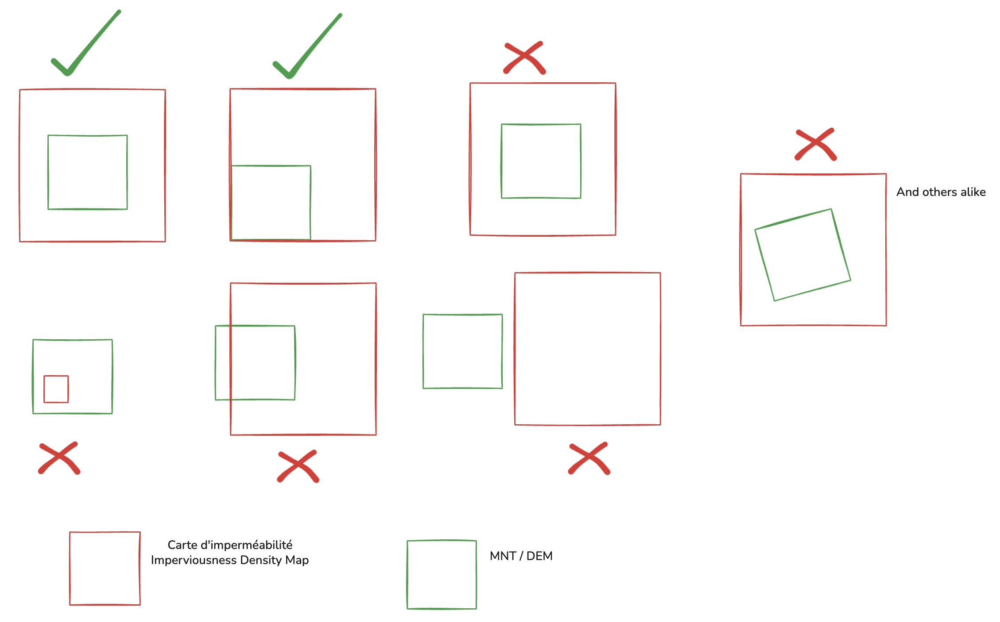

# Desealing Workflow

This folder contains the urban desealing internship workflow and a checked-in sample dataset that can be used to reproduce a baseline run.

The project supports two analysis modes:

1. `casier`: build a regular grid, compute a slope-based indicator from the DEM, combine it with imperviousness, and export a Shapefile with infiltration scores.
2. `ibk`: compute a simplified Beven-Kirkby / topographic wetness style raster analysis from the DEM.

## Files

- `Dockerfile`: container image for the workflow.
- `docker-compose.yml`: reproducible wrapper for the default Docker run.
- `requirements.txt`: Python dependencies.
- `main.py`: workflow entry point and CLI.
- `lecture.py`: raster loading helpers.
- `methods.py`: slope, grid, infiltration, and IBK calculations.
- `visualization.py`: PNG and interactive plotting helpers.
- `configtemplate.yaml`: template for creating your own run configuration.
- `donnees/myconfig.yaml`: checked-in baseline configuration for the sample data.
- `donnees/dem_default.tif`: sample DEM used by the baseline configuration.
- `donnees/imperviousness_default.tif`: sample imperviousness raster used by the baseline configuration.
- `img/image.png`: illustration showing how DEM coverage should fit inside the imperviousness raster coverage.

## Reproducible Baseline

The repository already includes everything needed for a baseline `casier` run:

- a Docker image definition,
- a Docker Compose wrapper,
- a checked-in configuration file,
- a sample DEM,
- a sample imperviousness raster.

From [`desealing`](.) you can reproduce that baseline with:

```powershell
docker compose build desealing
docker compose run --rm desealing
```

This runs:

```powershell
python -u main.py -c donnees/myconfig.yaml --docker
```

and writes the outputs into `output/`.

## Expected Inputs

The workflow uses GeoTIFF rasters:

- a DEM for both methods,
- an imperviousness raster for the `casier` method only.

The checked-in baseline configuration expects:

- `donnees/dem_default.tif`
- `donnees/imperviousness_default.tif`

For your own runs, place your rasters in `donnees/` or another mounted folder and update the config file paths accordingly.

After downloading the data for your area of interest, make sure the DEM area is fully contained within the imperviousness raster extent when using the `casier` method.



## Prepare Your Own Configuration

Copy [`configtemplate.yaml`](configtemplate.yaml) to a new file such as `donnees/myconfig-custom.yaml` and edit the values:

```yaml
method: "casier"
tile_path: "donnees/dem_default.tif"
imperviousness_path: "donnees/imperviousness_default.tif"
output_path: "output"
slope: "best_fit_plane"
casiersize: 10
imperviousness_factor: 0.4
```

Parameter notes:

- `method`: choose `casier` or `ibk`.
- `tile_path`: DEM raster path.
- `imperviousness_path`: required for `casier`.
- `output_path`: output directory, or an explicit vector file path such as `output/casiers_infiltration.shp` or `output/casiers_infiltration.gpkg`.
- `slope`: one of `mean_thresholded`, `best_fit_plane`, `slope_std_dev`, `slope_max`, `slope_mean_denoised`.
- `casiersize`: grid size in meters for `casier`.
- `imperviousness_factor`: weight between `0` and `1` for the imperviousness term.

## Run Locally Without Docker

From [`desealing`](.):

```powershell
python -m venv .venv
.venv\Scripts\activate
pip install -r requirements.txt
python main.py -c donnees/myconfig.yaml --no-docker
```

This mode opens plots interactively for the `casier` and `ibk` methods.

## Run With Docker

### Default baseline run

From [`desealing`](.):

```powershell
docker compose build desealing
docker compose run --rm desealing
```

Because `docker-compose.yml` mounts `./donnees` and `./output`, the generated shapefile and PNG files stay in your local repository.

### Run a custom configuration

If you created `donnees/myconfig-custom.yaml`, run:

```powershell
docker compose run --rm desealing python -u main.py -c donnees/myconfig-custom.yaml --docker
```

### Direct `docker run` equivalent

If you prefer not to use Compose, from [`desealing`](.):

```powershell
docker build -t ud-iarbre-desealing .
docker run --rm `
  -v "${PWD}/donnees:/usr/src/app/donnees" `
  -v "${PWD}/output:/usr/src/app/output" `
  ud-iarbre-desealing `
  python -u main.py -c donnees/myconfig.yaml --docker
```

## Main Options

The command-line interface accepts these main options:

- `-c`, `--config`: YAML configuration file path.
- `-t`, `--tile_path`: DEM path.
- `-i`, `--imperviousness_path`: imperviousness raster path.
- `-m`, `--method`: `casier` or `ibk`.
- `-cs`, `--casiersize`: grid size in meters.
- `-slope`, `--slope`: slope calculation method.
- `-if`, `--imperviousness_factor`: imperviousness weight.
- `-out`, `--output_path`: output directory.
- `--docker` / `--no-docker`: save figures instead of showing them interactively.

Full help:

```powershell
python main.py --help
```

## Outputs

For the baseline `casier` run, the workflow writes into `output/`:

- `casiers_infiltration.shp` plus companion Shapefile files such as `.dbf`, `.prj`, and `.shx`
- `casiers_infiltration.png`

If you keep the default Shapefile output, field names are shortened to respect the Shapefile 10-character limit:

- `imperviousness` -> `impervious`
- `normalized_slope` -> `norm_slope`
- `infiltration_index` -> `infilt_idx`

If you want to preserve the full field names, set `output_path` to a format such as `output/casiers_infiltration.gpkg`.

The `casier` result contains:

- grid geometry,
- slope values,
- normalized slope,
- imperviousness,
- infiltration index.

The `ibk` mode currently displays the generated rasters but does not export them as GeoTIFF files.

## Data Preparation Notes

To harmonize raster data in QGIS before running the workflow:

1. Check the CRS of both rasters in layer properties.
2. Reproject one raster if the CRS differ.
3. Clip rasters so they cover the same area.
4. Verify that both layers align correctly.

Recommended sources mentioned in the original internship documentation:

- DEM: <https://geoservices.ign.fr/rgealti>
- Imperviousness density: <https://land.copernicus.eu/en/products/high-resolution-layer-imperviousness/imperviousness-density-2018#download>

## Team

- Pierre-Antoine CHIRON
- John SAMUEL
- Gilles GESQUIERE
