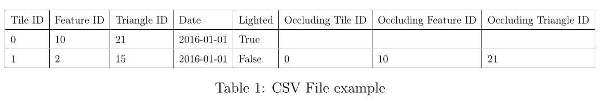

# Sunlight and Shadow Analyses

## Cloning the submodules

This repository contains submodules, which need to be pulled (if you didn´t already specify --recusive when cloning the repo)

```bash
git clone --recursive [link] # If you haven´t cloned this repository yet

git submodule update --init # If the repository is already cloned
```

## Team

* Marwan Ait-Addi
* John Samuel
* Gilles Gesquière

## Description

This project aims to provide tools to calculate sunlight exposure of city objects, using data in the [3DTiles](https://www.ogc.org/standards/3dtiles/) format it is composed of multiple subprojects that all work together to form a coherent toolsuite. Using pySunlight-docker you will need to provide [b3dm](https://cesium.com/learn/3d-tiling/tiler-data-formats/) 3DTiles, a format for 3D triangulated geospatial data, and the output will be in the CSV format.

1. [Sunlight](https://github.com/VCityTeam/Sunlight) This is the C++ library that is used by pySunlight *You don´t need to worry about to use pySunlight*
2. [pySunlight](https://github.com/VCityTeam/pySunlight)
3. [pySunlight-Docker](https://github.com/VCityTeam/pySunlight-docker) **Use this if you don´t already know where to start**
4. [UD-Sunlight-demo](https://github.com/VCityTeam/UD-Demo-Sunlight) A small web app for visualisation
5. The Sunpath calculation script that is compatible with the aforementioned tools. It can be found in the SunpathTool directory.
6. The technical report that can be found in this folder.

Each projects' github repository contains its own documentation. As well as use cases and examples.
Each one is dependent on the previous project (pySunlight is dependent on Sunlight, and pySunlight-docker is a dockerised version of pySunlight).

The sunpath calculation script is optional, and only needed if you want to calculate sunlight outside of the pre-calculated 1975-2075 range.

### pySunlight's export format

pySunlightś intended export format is the CSV, it contains information about each triangle of the geometry, which can be related to the original geometry through its Tile, Feature and Triangle IDs.



Information about the lighting is found on the `Lighted`column, and if a triangle is occulted (i.e. Lighted is false), the occulting triangle will be loged in the following columns.
