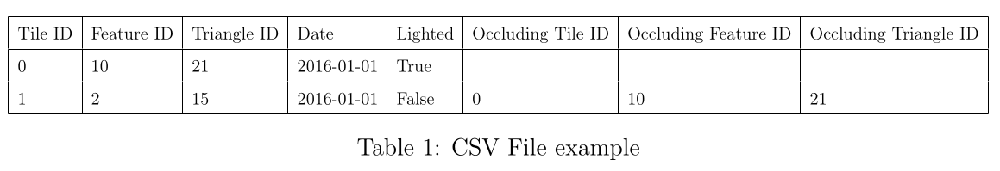

# Sunlight and Shadow Analyses

## Cloning the submodules

This repository contains submodules, which need to be pulled if you did not already clone the repository with `--recursive`.

```bash
git clone --recursive [link]

git submodule update --init --recursive
```

## Docker

This directory now includes a repo-local Docker environment inspired by `../pySunlight-docker`, but wired to the `sunlight-shadow` submodules already declared in this repository.

The build runs from the repository root, copies `.git` and `.gitmodules`, and initializes the four `sunlight-shadow` submodules during image build. This lets the stack work both with:

1. a recursive clone where submodules are already present locally
2. a regular clone where Docker fetches the missing submodules during build

### pySunlight workflow

Copy the example environment file:

```bash
cp .env.example .env
```

Put your 3D Tiles dataset into `inputs/` with this structure:

```text
inputs/
  tileset.json
  tiles/
    tile_x.b3dm
```

Build the `pysunlight` image:

```bash
docker compose --profile pysunlight build pysunlight
```

Run one timestamp:

```bash
docker compose --profile pysunlight run --rm \
  -e TIMESTAMP=2020-05-05T12:00 \
  pysunlight
```

Run a time interval with the legacy hour-based range:

```bash
docker compose --profile pysunlight run --rm \
  -e START_DATE=403224 \
  -e END_DATE=403248 \
  pysunlight
```

The host folders are controlled by `.env`:

```bash
INPUT_PATH=/inputs
INPUTS_FOLDER=./inputs
OUTPUTS_FOLDER=./output
```

`INPUT_PATH` is the directory passed to `pySunlight`. Leave it as `/inputs` when `tileset.json` is directly under the mounted folder. If your dataset is nested, set it to something like `/inputs/lyon_dataset`.

### Sunpath tool

Build the helper image:

```bash
docker compose --profile sunpath build sunpath
```

Run the default help command:

```bash
docker compose --profile sunpath run --rm sunpath
```

Run a concrete computation and write the CSV into `output/`:

```bash
docker compose --profile sunpath run --rm sunpath \
  --latitude 45.75 \
  --longitude 4.85 \
  --start-year 1975 \
  --end-year 2075 \
  --filename /workspace/output/sunpath_lyon.csv
```

If the submodules are not already initialized in the local checkout, the `pysunlight` Docker build still needs network access so `git submodule update --init --recursive` can fetch them.

### Demo visualization

This repository now includes a repo-local visualization service based on `UD-Demo-Sunlight`.

The demo serves:

1. the demo app itself
2. your mounted `inputs` directory as `/data/inputs`
3. your mounted `output` directory as `/data/output`

Build and run the demo:

```bash
docker compose --profile demo build sunlight-demo
docker compose --profile demo up sunlight-demo
```

Then open:

```text
http://127.0.0.1:8080/
```

By default the demo reads:

```text
/data/inputs/tileset.json
/data/output/output.csv
```

Because `pySunlight` writes timestamped directories, you will usually want to point the demo to a timestamped CSV file, for example:

```text
http://127.0.0.1:8080/?tileset=/data/inputs/tileset.json&csv=/data/output/2020-05-05__1200/output.csv
```

You can also set defaults in `.env`:

```bash
DEMO_TILESET_URL=/data/inputs/tileset.json
DEMO_CSV_URL=/data/output/2020-05-05__1200/output.csv
```

## Team

* Marwan Ait-Addi
* John Samuel
* Gilles Gesquiere

## Description

This project aims to provide tools to calculate sunlight exposure of city objects using data in the [3DTiles](https://www.ogc.org/standards/3dtiles/) format. It is composed of multiple subprojects that work together as a coherent tool suite. Using `pySunlight-docker` you provide [b3dm](https://cesium.com/learn/3d-tiling/tiler-data-formats/) 3DTiles, a format for 3D triangulated geospatial data, and the output is in CSV format.

1. [Sunlight](https://github.com/VCityTeam/Sunlight) is the C++ library used by `pySunlight`.
2. [pySunlight](https://github.com/VCityTeam/pySunlight)
3. [pySunlight-Docker](https://github.com/VCityTeam/pySunlight-docker) is the recommended starting point.
4. [UD-Sunlight-demo](https://github.com/VCityTeam/UD-Demo-Sunlight) is a small visualization web app.
5. The sunpath calculation script compatible with the other tools is available in the `SunpathTool` directory.
6. The technical report is available in this folder.

Each project's repository contains its own documentation, examples, and use cases. Each one depends on the previous project: `pySunlight` depends on `Sunlight`, and `pySunlight-docker` is a containerized version of `pySunlight`.

The sunpath calculation script is optional and is only needed if you want to calculate sunlight outside of the pre-calculated 1975-2075 range.

### pySunlight's export format

`pySunlight`'s intended export format is CSV. It contains information about each triangle of the geometry, which can be related back to the original geometry through its Tile, Feature, and Triangle IDs.



Information about the lighting is found in the `Lighted` column. If a triangle is occulted, meaning `Lighted` is `false`, the occulting triangle is logged in the following columns.
