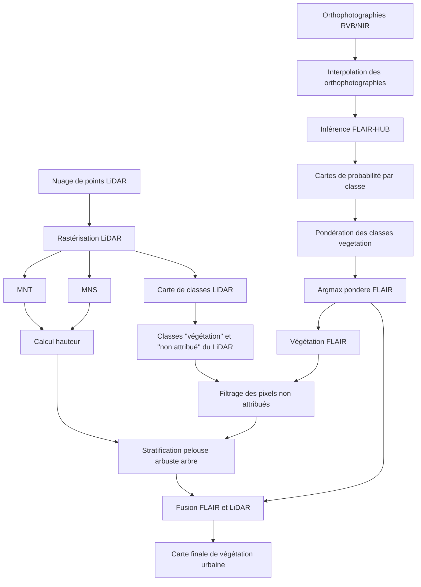

# Méthodologie de l'utilisation de Flair-Hub pour la segmentation de végétation urbaine

| FRANCE 2030 | Banque des Territoires, Groupe Caisse des Dépôts | IA.rbre | LIRIS |
| --- | --- | --- | --- |
|  |  |  |  |

---

- Projet
  - **Projet** : IA.rbre
  - **Porteur du projet** : TelesCoop
  - **Membres du consortium** :
    - Métropole de Lyon
    - TelesCoop
    - Université Lumière Lyon 2 (agissant pour le compte du LIRIS)
  - **Durée** : 36 mois (2025 à 2028)
  - **Début** : 2025-03-10
  - **Appel à projet** : Démonstrateurs d’IA frugale au service de la transition écologique de territoires (DIAT)
  - **Plan** : FRANCE 2030
  - **Financement** : Banque des Territoires, Groupe Caisse des Dépôts

---

- Document
  - **Auteur(s)** :
    - Arthur Villarroya-Palau
  - **Relecteur(s)** :
    - Gilles Gesquière
    - John Samuel
    - Mika Inisan
  - **Date de création** : 2025-12-15
  - **Date de dernière mise à jour** : 2026-01-07
  - **Version** : 1.0.5
  - **Classification documentaire** : Interne
  - **Langue** : Français
  - **Statut** : Brouillon
  - **Licence** : GNU LGPL v2.1

---

## Introduction

Ce travail vise à proposer une méthodologie opérationnelle pour la production d’une carte d’inventaire de la végétation en milieu urbain, en s’appuyant sur la combinaison de modèles de segmentation par deep learning et de données LiDAR. Il s’inscrit dans la continuité de travaux existants sur la segmentation de la végétation urbaine.

Les modèles proposés dans FLAIR-HUB constituent aujourd’hui une base robuste et reproductible pour la segmentation sémantique d’images aériennes à très haute résolution. Toutefois, ces modèles ont été conçus initialement pour des tâches générales d’occupation du sol, et non spécifiquement pour l’inventaire de la végétation urbaine. En pratique, si les classes végétales arbusives et herbacés sont plutôt correctement identifiées, les résultats restent plus incertains pour certaines strates intermédiaires. Utilisé seul, FLAIR-HUB fournit ainsi une information précieuse mais pas assez pour répondre aux besoins d’un inventaire végétal structuré.

Les données LiDAR apportent, quant à elles, une information complémentaire essentielle en décrivant la structure verticale du milieu urbain. Elles permettent notamment de différencier des strates de végétation en fonction de la hauteur, ce qui constitue un atout majeur pour la caractérisation des arbres et des formations arbustives. Néanmoins, l’utilisation du LiDAR présente également des limites importantes. Les données ne sont pas disponibles de manière systématique à une fréquence annuelle, ce qui complique le suivi temporel, et la végétation herbacée y est souvent difficile à distinguer du sol ou de surfaces planes telles que les routes ou les places. Le LiDAR seul ne permet donc pas de produire une cartographie complète et fiable de l’ensemble des strates de végétation.

Pour une information plus précise de ce qu'est que FlairHub ou le Lidar nous vous invitons à lire les documents suivants: [Revue sur COSIA et FLAIRHUB](Revue-COSIA-FLAIRHUB.md), [Synthèse sur LidarHD](Synthese-LidarHD.md), [Revue sur la segmentation de la végétation urbaine](Revue-segmentation-végétation-urbaine)

Face à ces constats, ce document introduit une méthodologie qui vise à combiner les apports respectifs de la segmentation optique issue de FLAIR-HUB et de l’information structurelle fournie par le LiDAR. L’objectif est de tirer parti de la complémentarité de ces deux sources afin de produire des données d’inventaire de la végétation urbaine plus cohérentes, plus structurées et mieux adaptées aux besoins opérationnels. Le cœur de ce travail est consacré à la description détaillée de cette chaîne de traitement, depuis la préparation des données jusqu’à la production de la carte finale.

Enfin, ce travail ouvre également la perspective d’une adaptation des modèles de FLAIR-HUB à des contextes locaux spécifiques par le biais du fine-tuning, en s’appuyant sur des données de vérité terrain dédiées à la végétation urbaine, telles que celles issues de **Armature2 et collectif** (https://imu.universite-lyon.fr/armature-2-282507.kjsp?RH=imu_proj et https://collectifs-biodiversite.universite-lyon.fr/carte-dynamique-vegetation/) ou d'autres données de vérité terrain. Cette approche permet d’envisager la production de cartes de végétation pour des années où les données LiDAR ne sont pas disponibles, en exploitant uniquement des données orthophotographiques.

## Méthodologie de combinaison FLAIR-HUB et LiDAR

La méthodologie proposée repose sur une chaîne de traitement hybride combinant une segmentation sémantique issue de FLAIR-HUB appliqués aux données orthophotographiques et des données LiDAR. L’objectif est de tirer parti des capacités de généralisation des modèles de FLAIR-HUB tout en intégrant l’information de hauteur et de classification fournie par le LiDAR afin d’améliorer la caractérisation des strates de végétation.

Dans un premier temps, une inférence est réalisée à partir d’un modèle préentraîné de FLAIR-HUB sur les données orthophotographiques d’entrée. Les données orthophotogrpahiqes d'entrée doivent être à une resolution suffisament élevé pour des résultats précis mais pas trop pour ne pas dépasser les capacité de segmentation du modèle. La résolution privilégiée est de 20cm par pixel puisque les modèles de FLAIR-HUB ont été entrainé avec cette réslution. Un interpolation des images ortophotographiques bi-cubique est aussi à est également à privilégier, afin de préserver au mieux l’information spectrale et spatiale, de limiter les artefacts liés au rééchantillonnage et d’assurer une cohérence optimale entre les données d’entrée et les caractéristiques apprises par le modèle lors de l’entraînement. Contrairement à une sortie standard sous forme de carte de classes finales (argmax), l’inférence est configurée pour produire des cartes de probabilités par classe. Chaque pixel est ainsi associé à un vecteur de probabilités couvrant l’ensemble des classes du modèle, soit une image de dimensions m × n × N, où N correspond au nombre total de classes (19 classes dans notre cas). Cette représentation par probabilité peut permettre des ajustements en post-traitement.

Sur la base de ces cartes de probabilités, une modification de l’importance relative de certaines classes peut être ensuite appliquée. En particulier, les classes associées à la végétation peuvent être pondérées afin d’augmenter leur influence lors de la sélection finale par argmax. Concrètement, les probabilités de ces classes sont multipliées par un facteur fixé empiriquement (par exemple un facteur 2), ce qui favorise leur sélection lorsque plusieurs classes présentent des probabilités proches. Cette étape ne modifie pas les poids internes du modèle, mais agit uniquement sur l’interprétation des sorties de probabilité, permettant ainsi de donner plus de poids aux classes pour un certain objectif de segmentation urbaine.

En parallèle, les données LiDAR sont préparées afin d’être intégrées au processus de fusion. Le nuage de points est rasterisé pour produire trois couches principales : une carte de classes LiDAR, un modèle numérique de terrain (MNT) et un modèle numérique de surface (MNS). La carte de classes LiDAR est construite en attribuant à chaque pixel la classe du point le plus élevé. Cela peut avoir comme défaut d'oublier de la végétation en dessous de certaines structures que le LiDAR pourrait avoir repéré, mais s'inscrit mieux dans le processus de fusion avec une segmentation sur des orthophtographies (donc vu par sur le haut). Cette étape met l’information LiDAR sous une forme compatible avec les résultats raster issus de FLAIR-HUB.

À partir du MNS et du MNT, une carte de hauteur relative est ensuite calculée en estimant, pour chaque pixel, la hauteur des objets au-dessus du sol. Cette information est essentielle pour différencier les strates de végétation et pour distinguer les objets verticaux (arbres, arbustes) des surfaces planes. La carte de hauteur constitue donc un indicateur pour la suite du traitement.

La fusion entre les résultats de FLAIR-HUB et ceux issus du LiDAR s’effectue alors en plusieurs étapes. Les pixels correspondant aux classes de végétation issues de FLAIR-HUB sont sélectionnés, ainsi que les pixels LiDAR appartenant aux classes végétation ou à la classe dite « non attribuée », cette dernière pouvant contenir des points de végétation dans certains contextes urbains. Pour ces pixels non attribués, une règle est appliquée : un pixel est conservé comme végétation uniquement s’il correspond à un pixel classé comme végétation par FLAIR-HUB. Cette étape permet de limiter les faux positifs tout en récupérant des éléments végétaux mal identifiés par le LiDAR seul. Il faut noter que cette approche pour les pixels LiDAR non attribués est limité en fonction de la qualité du LiDAR. En effet plus la qualité du LiDAR est bonne, plus le fait de prendre en compte les pixels non attribués rajoute un nombre de pixels de faux positif non négligeable. 

Une fois les pixels végétalisés identifiés, l’information de hauteur issue du LiDAR est utilisée pour discriminer les différentes strates de végétation. Selon des seuils de hauteur définis, les objets sont classés en végétation herbacée, arbustive ou arborée. Cette classification verticale permet de structurer l’inventaire de la végétation de manière plus fine que la segmentation optique seule.

Enfin, les résultats issus de FLAIR-HUB et du LiDAR sont fusionnés en donnant la priorité à l’information LiDAR pour les pixels identifiés comme végétation. Lorsqu’un pixel est classé comme végétalisé par les deux sources, la classe issue du LiDAR prévaut, en raison de sa capacité à discriminer les strates par la hauteur. En revanche, dans les zones où le LiDAR est absent ou peu informatif, la classification issue de FLAIR-HUB est conservée. Cette stratégie de fusion permet de produire une carte finale cohérente, combinant la continuité spatiale et la richesse spectrale de l’imagerie optique avec la précision structurelle du LiDAR.

### Fine-tuning de FLAIR-HUB

Afin de pallier les limitations liées à la disponibilité irrégulière des données LiDAR et d’améliorer la qualité de la cartographie des strates de végétation urbaine prédite par FLAIR-HUB, le processus de *fine-tuning* des modèles de FLAIR-HUB peut être mise en place. Cette approche consiste à réentraîner partiellement un modèle préentraîné à partir de données de vérité terrain différentes, telles que celles issues d’**Armature2** ainsi que des cartes rasterisé des données LiDAR lorsqu’elles sont disponibles.

Les modèles FLAIR-HUB, initialement entraînés à grande échelle sur des données IGN, disposent déjà de capacités robustes d’extraction de caractéristiques spectrales et spatiales à partir d’orthophotographies. Afin de préserver ces acquis tout en adaptant le modèle aux spécificités locales de la végétation urbaine, le fine-tuning est réalisé en ne réentraînant que la **partie décodeur** du réseau de segmentation. Le décodeur est responsable de la production des cartes de classes finales, tandis que l’encodeur, chargé de l’extraction des descripteurs visuels, est maintenu gelé. Cette stratégie permet de conserver au maximum les forces du modèle initial, tout en ajustant la sortie de segmentation aux besoins de l’inventaire végétal urbain.

Le processus de fine-tuning repose sur les étapes suivantes :
- **Préparation des données d’entraînement locales** : les orthophotographies sont associées à des labels de végétation issus de relevés terrain (Armature2, collectifs biodiversité) ou de cartes de végétation produites à partir du LiDAR pour certaines années. Les classes sont harmonisées afin de correspondre aux strates de végétation ciblées (herbacée, arbustive, arborée).
- **Réentraînement ciblé du décodeur** : le décodeur du modèle FLAIR-HUB est réentraîné à partir de ses poids initiaux, tandis que l’encodeur reste gelé. Cette configuration permet d’adapter la segmentation sans dégrader les représentations apprises à grande échelle au préalable.
- **Évaluation et validation** : les performances du modèle sont évaluées sur des jeux de données indépendants, toujours celle d'Armature2 ou du LiDAR mais sur des tuiles différnetees de celles de l'entrainement. Ceci permet de vérifier les performances du modèle sur la nouvelle segmentation souhaitée.
- **Application aux années sans données LiDAR** : une fois le modèle adapté, il peut être appliqué aux orthophotographies d’années pour lesquelles les données LiDAR ne sont pas disponibles. La segmentation obtenue repose alors uniquement sur l’information optique, mais bénéficie de l’apprentissage indirect des structures de végétation acquis lors du fine-tuning.

Cette approche de fine-tuning constitue ainsi une autre solution pour l'utilisation de Flair lorsque les données LiDAR ne sont pas disponibles dans le cadre de la création d'un inventaire végétal.
