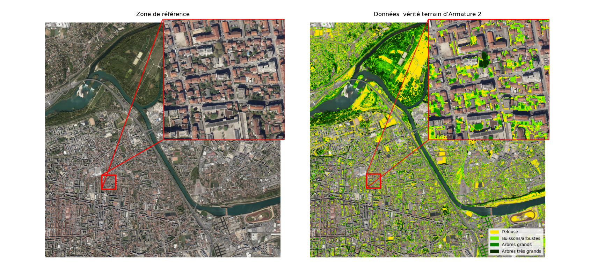
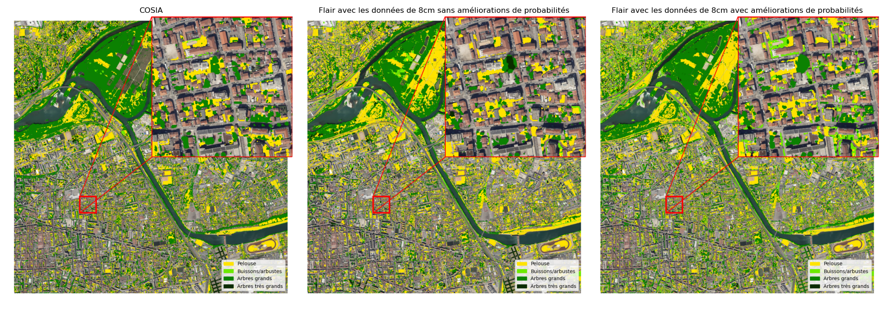
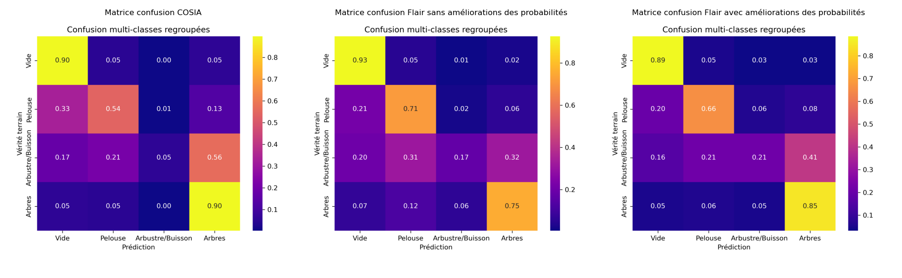
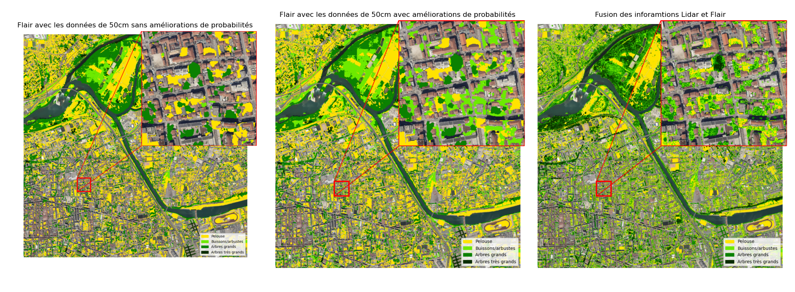
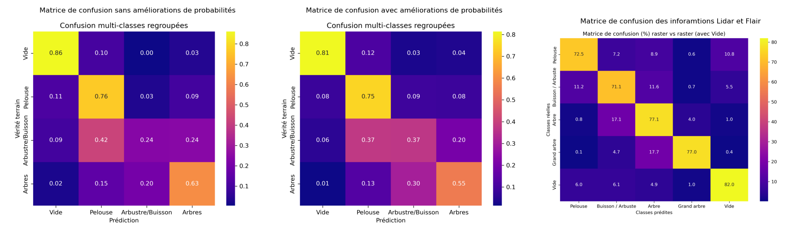

# Synthèse de COSIA et FLAIR-HUB sur la segmentation de la végétation urbaine 

| FRANCE 2030 | Banque des Territoires, Groupe Caisse des Dépôts | IA.rbre | LIRIS |
| --- | --- | --- | --- |
|  |  |  |  |

---

- Projet
  - **Projet** : IA.rbre
  - **Porteur du projet** : TelesCoop
  - **Membres du consortium** :
    - Métropole de Lyon
    - TelesCoop
    - Université Lumière Lyon 2 (agissant pour le compte du LIRIS)
  - **Durée** : 36 mois (2025 à 2028)
  - **Début** : 2025-03-10
  - **Appel à projet** : Démonstrateurs d’IA frugale au service de la transition écologique de territoires (DIAT)
  - **Plan** : FRANCE 2030
  - **Financement** : Banque des Territoires, Groupe Caisse des Dépôts

---

- Document
  - **Auteur(s)** :
    - Arthur Villarroya-Palau
  - **Relecteur(s)** :
    - Gilles Gesquière
    - John Samuel
    - Mika Inisan
  - **Date de création** : 2025-09-24
  - **Date de dernière mise à jour** : 2025-11-22
  - **Version** : 2.0.3
  - **Classification documentaire** : Public
  - **Langue** : Français
  - **Statut** : Final
  - **Licence** : GNU LGPL v2.1

---

## Résumé
Cette synthèse s’intéresse aux outils récents de segmentation d’images aériennes et satellitaires développés par l’IGN, en particulier **COSIA** et **FLAIR-HUB**. Bien que conçus différemment, ils partagent un objectif commun : fournir des classifications robustes de l’occupation du sol. Ici, nous nous intéresserons plus en détails aux performances de ces outils. Après une présentation de leurs principes et de leurs résultats, nous proposons une comparaison à partir des données de vérité terrain issues du projet **Armature2 et collectif** (https://imu.universite-lyon.fr/armature-2-282507.kjsp?RH=imu_proj et https://collectifs-biodiversite.universite-lyon.fr/carte-dynamique-vegetation/). Enfin, nous ouvrons la réflexion sur les perspectives offertes par l’intégration de FLAIR-HUB avec d’autres sources de données et méthodes de fine tuning pour faire un inventaire de la végétation urbaine dans la ville de Lyon.

Ce document fait partie d’une synthèse plus large consacrée à la **segmentation de la végétation urbaine** et aux méthodes de deep learning associées, disponible au lien suivant : [Revue sur la segmentation de la végétation urbaine par Deep Learning](Revue-segmentation-végétation-urbaine.md).

## COSIA
**COSIA (Couverture du Sol par Intelligence Artificielle)** (https://geoservices.ign.fr/cosia) est une base nationale de classification du territoire français, produite par l’IGN dans le cadre du programme **OCS GE** (https://geoservices.ign.fr/ocsge). Elle repose sur une chaîne de traitement automatique combinant orthophotos (BD ORTHO®) (https://geoservices.ign.fr/bdortho), données altimétriques (MNT RGE ALTI®, MNS) et annotations manuelles couvrant plus de 2 500 km² répartis sur 63 départements. Les données sont produites à une résolution de 20 cm/pixel et mises à jour après chaque campagne aérienne, ce qui garantit une continuité temporelle.  

COSIA fournit une classification en **quinze classes principales de couverture du sol**, telles que définies dans le document de référence [1]. Ces classes incluent le **bâti**, les **zones imperméabilisées**, les **zones agricoles**, les **surfaces herbacées**, les **formations ligneuses basses** (arbustes, broussailles), les **forêts de feuillus et de conifères**, ainsi que les **zones humides et plans d’eau**. Ce système de classes vise à fournir une couverture homogène et exploitable sur tout le territoire. 

La description de chaque classe vous est présentée en annexe du document. 

Le modèle utilisé dans ce projet repose sur des techniques de deep learning appliquées à l’analyse d’images, telles que des réseaux de neurones convolutifs (CNN) ou des Vision Transformers (ViT). Il estime, pour chaque pixel, la probabilité d’appartenance à une classe donnée (par exemple : arbre, pelouse, buisson, sol nu, etc.). Les performances du modèle sont évaluées à l’aide d’indicateurs standards de la classification supervisée : la précision (proportion de pixels correctement identifiés parmi ceux prédits comme appartenant à une classe), le rappel (proportion de pixels correctement détectés parmi tous ceux réellement appartenant à cette classe), et l’Intersection over Union (IoU), qui mesure le recouvrement entre les zones prédites et les zones de référence. Sur les millésimes 2017–2023, le modèle COSIA atteint une précision moyenne de 79,5 %, un rappel de 81 % et un IoU moyen de 68,1 %. Bien que performant à grande échelle, la base présente certaines limites : plusieurs ateliers métiers ont relevé des difficultés dans la distinction des strates végétales intermédiaires (par exemple les arbustes), ce qui peut limiter son usage dans des contextes nécessitant une stratification fine de la végétation.

Cependant, il faut garder à l’esprit que nous n’avons aucun moyen de connaître le type de modèle utilisé précisément par l’IGN pour produire les données COSIA. Cela peut poser certains soucis de réplicablité et de disponibilité des données. Cependant, comme nous allons le voir dans la suite, le projet FLAIR-HUB dont COSIA est la continuité, permet de déduire le type de modèle utilisé par l'IGN pour produire COSIA.

## FLAIR-HUB
**FLAIR-HUB** est un outil open source issu du programme FLAIR (https://ignf.github.io/FLAIR/FLAIR-HUB/FLAIR-HUB_fr.html), développé par l’IGN. Contrairement à COSIA, il ne fournit pas une base prédite mais des modèles préentraînés pouvant être appliqués localement sur différentes données : orthophotos RVB ou infrarouges, images SPOT ou Sentinel, ou encore Lidar converti en raster. Dans ce dernier cas, les nuages de points Lidar sont transformés en images 2D où chaque pixel représente une valeur issue des mesures laser (par exemple la hauteur ou l’intensité du signal), ce qui permet de les utiliser dans des modèles d’apprentissage automatique conçus pour traiter des images.

FLAIR-HUB constitue aujourd’hui le plus vaste jeu de données multimodal à très haute résolution publié par l’IGN dans le cadre du programme FLAIR. Les données sont organisées en patches d’images de 512 × 512 pixels à 20 cm/pixel, ce qui correspond à des extraits d’environ 100 × 100 mètres au sol. Cette découpe est essentielle pour l’entraînement des modèles de deep learning, qui ne peuvent traiter efficacement de très grandes images, et permet en outre de générer une base d’échantillons homogène et réutilisable. Ces patches sont regroupés en 74 régions d’intérêt (ROI ou Region of interest), sélectionnées pour représenter la diversité des contextes urbains, périurbains, agricoles et naturels. Les ROIs sont elles-mêmes déclinées en domaines spatio-temporels, car certaines zones disposent de plusieurs acquisitions (archives aériennes, séries temporelles Sentinel-2, etc.), ce qui ouvre la possibilité d’analyser l’évolution saisonnière ou interannuelle du territoire.

FLAIR-HUB propose aussi un dataset de données sur le territoire. Au total, FLAIR-HUB couvre près de 2 528 km², avec un ensemble aligné de modalités complémentaires : orthophotographies aériennes RVBI à 20 cm, images SPOT et Sentinel-2 multispectrales, Sentinel-1 radar (ascendant et descendant), modèles numériques de terrain et de surface (MNT/MNS), ainsi que des images aériennes historiques. L’ensemble des modalités est géographiquement et temporellement aligné, ce qui en fait une ressource unique pour la segmentation multimodale. Les annotations fournies se déclinent en deux grandes familles : AERIAL LABEL-COSIA, issue de photo-interprétation et suivant la nomenclature nationale de COSIA, et AERIAL LABEL-LPIS, dérivée des bases agricoles LPIS pour les cultures. Cette structuration assure à la fois la richesse, la diversité et la comparabilité des résultats produits à partir de FLAIR-HUB. [2].

Vous pouvez retrouvez le Github (https://github.com/IGNF/FLAIR-HUB/tree/main) du projet ainsi que son site web (https://ignf.github.io/FLAIR/FLAIR-HUB/FLAIR-HUB.html)

Sur le plan technique, les expérimentations réalisées par FLAIR-HUB s’appuient sur des architectures récentes de vision par ordinateur. Elles utilisent notamment le Swin Transformer comme encodeur, par exemple la configuration swin_base_patch4_window12_384 — associé à un décodeur de segmentation tel que UPerNet, basé sur une pyramide de caractéristiques et une tête de segmentation. Cette combinaison, souvent désignée sous le nom Swin + UPerNet, permet de produire des cartes de segmentation précises à partir d’images de télédétection. Les expériences montrent que la fusion multimodale (aérien VHR + Sentinel-2/1 + SPOT + DEM) améliore la performance globale. Le Swin Transformer est un modèle basé sur l’attention hiérarchique : il divise les images en fenêtres (patches) et applique un mécanisme d’attention glissant, ce qui permet de capturer efficacement le contexte spatial à différentes échelles. UPerNet, de son côté, est un décodeur qui agrège les informations issues de plusieurs niveaux de la hiérarchie du réseau pour produire une segmentation précise, pixel par pixel. L’association des deux permet de conserver à la fois une vision globale et une précision locale, un compromis particulièrement adapté à la segmentation d’images aériennes à haute résolution. 

Pour en savoir plus sur ces modèles nous vous invitons à lire l'article [3]. Vous pouvez également trouver un résumé de chaque technologie Deep Learning concernant la segmanetation d'images dans l'article plus large consacré à la **segmentation de la végétation urbaine** et aux méthodes de deep learning associées, disponible au lien suivant : [Revue sur la segmentation de la végétation urbaine par Deep Learning](Revue-segmentation-végétation-urbaine.md).

La nomenclature fournie dans FLAIR-HUB comprend 19 classes (0→18) pour la couverture du sol (AERIAL LABEL-COSIA) et, en parallèle, une hiérarchie de classes pour les cultures (LABEL-LPIS). Dans les expériences rapportées, seules les premières 15 classes sont systématiquement utilisées ; les classes en fin de nomenclature correspondent à des étiquettes « faibles » (weak labels) ou ambiguës (ex. ligneous, mixed, undefined). La table complète des 19 classes et les fréquences par partition (train/val/test) sont présentées dans l’article FLAIR-HUB [2].

L’un des avantages majeurs de FLAIR-HUB est la disponibilité de modèles préentraînés avec leurs poids sur **HuggingFace** (https://huggingface.co/collections/IGNF/flair-hub-land-cover-mapping-models-lc-683ec04c4e19788e64aa032f
), ce qui facilite la réplicabilité et l’adaptation à de nouvelles données. Ces modèles peuvent être utilisés directement pour l’inférence, mais il est également possible de les fine-tuner sur des jeux de données spécifiques, ce qui permet de modifier les poids du modèle et d’améliorer ses performances sur des contextes particuliers. Dans les fichiers de configuration YAML, l’utilisateur peut spécifier le type de sortie souhaité : soit une carte d’argmax (chaque pixel est associé à la classe de probabilité la plus élevée), soit des cartes de probabilités complètes (une image de dimensions m × n × nb_classes, contenant pour chaque pixel un vecteur de probabilités sur l’ensemble des classes). Cette seconde option est particulièrement utile pour le post-traitement, par exemple pour ajuster les seuils de détection ou recombiner les probabilités, ce qui peut améliorer la qualité des cartes produites sur des classes difficiles à distinguer, comme certaines strates végétales. Cette flexibilité dans la gestion des sorties et la possibilité d’adapter le modèle constitue une différence clé avec COSIA, qui ne fournit pas ses modèles préentraînés et fonctionne davantage comme une base de données annotées de terrain.

## Résultats et comparaison
Dans cette partie, nous allons comparer les résultats avec une donnée que l'on va considérer comme vérité terrain. Ces résultats permettront de faire une conclusion sur l'utilisation que l'on peut avoir des données de COSIA et de l'utilisation que l'on peut avoir de FLAIR-HUB.  

### Données de vérité terrain Armature 2

Les travaux effectués dans **Armature 2** par Arnaud Bellec (2018) [4] constituent une référence importante pour la cartographie de la végétation urbaine. Réalisés sur la métropole de Lyon, ils reposent principalement sur l’utilisation d’orthophotographies à très haute résolution, enrichies par des données complémentaires comme le Lidar et des indices de végétation. L’objectif était de caractériser l’évolution de la végétation urbaine sur plusieurs décennies, en distinguant finement différentes strates végétales. Le produit final de ces recherches a été publié sous la forme d’une donnée raster stratifiée, disponible notamment pour l’année 2018, qui discrimine la végétation en cinq classes : herbacées, buissons (<1,5 m et couleur jaune), arbustes (1,5–5 m, et couleur vert claire), petits arbres (5–15 m, couleur verte) et grands arbres (>15 m couleur verte foncé).

Cette base se distingue par son haut niveau de précision, lié à la combinaison d’orthophotos et de Lidar, mais elle présente aussi certaines limites. D’une part, les données ont été produites à l’aide du logiciel propriétaire eCognition, et les paramètres exacts utilisés lors de leur création ne sont pas connus, ce qui limite la reproductibilité des résultats. D’autre part, les données ne sont disponibles que pour l’année 2018, ce qui empêche de mettre à jour automatiquement l’inventaire lorsque de nouvelles orthophotographies deviennent disponibles. Malgré ces limites, ces données sont considérées comme une vérité terrain validées par les services de la métropole concernés pour évaluer les performances des modèles de segmentation récents tels que COSIA et FLAIR-HUB. Elles constituent donc un point de comparaison pour valider les résultats.

Pour avoir le résumé complet des techniques utilisé par Arnaud Bellec afin d'obtenir ces données vous pouvez lire le document suivant : [Synthèse de la thèse d'Arnaud Bellec](Synthese-These-Arnaud-Bellec-2018.md)

### Réulstats de COSIA et FLAIR-HUB
Pour comparer COSIA et un modèle avec les données d'Armature 2, nous allons prendre les données de COSIA et faire une inférence du modèle de FLAIR-HUB sur une zone de Lyon prise arbitrairement. Une zone qui offre une végétation dense d'une part et une zone fortement urbaine. Cette zone a été choisie, car elle avait des propriétés de test intéressante tel que le fait d'avoir une large partie boisée et forestière pour évaluer le repérage des différentes strates dans un lieu hautement végétalisé, et d'une large partie urbaine afin d'évaluer les perfomances des modèles et données disponibles dans des milieux hétérogènes. Dans cette partie, un zoom sur une zone urbaine sera proposé afin de voir plus en détail les performance de chaque technique en les comparants avec les données d'Armature 2. De plus, nous allons aussi effectuer une comparaison entre les inférences de FLAIR-HUB avec les données orthophotographiques de 8 cm par pixel et les inférences de FLAIR-HUB avec les données ortophotographiques de 50 cm. Les données de 50 cm sont obtenues grâce à une réduction de l'échelle sur les données de 8 cm. 

Les évaluations menées sur la végétation urbaine à Lyon montrent que, lorsqu’on compare les sorties de FLAIR-HUB aux données de COSIA, on retrouve globalement les mêmes difficultés sur les strates intermédiaires (végétation moyenne : buissons, broussailles, jeunes repousses). Sur ces catégories, les résultats obtenus par FLAIR-HUB sont parfois encore moins stables, ce qui complique leur utilisation pour produire un patrimoine végétal fiable.

L’inférence sur des orthophotos à 8 cm/pixel met en plus en évidence plusieurs limites :
- un temps de calcul très long (jusqu’à 1 h pour une zone de 62 500 × 62 500 pixels sur une machine modeste),
- l’apparition d’artefacts liés à la résolution très fine, qui perturbent la classification,
- et une précision qui reste insuffisante pour les strates intermédiaires, même après ajustement manuel des probabilités.

FLAIR-HUB proposant une carte de probabilité par classe, il est possible de modifier les poids après l’inférence. Ces ajustements permettent d’obtenir une petite amélioration sur la végétation moyenne, mais cela reste limité.

Lorsque FLAIR-HUB est appliqué sur des orthophotos à 50 cm/pixel, les résultats sont nettement plus stables et plus cohérents. La résolution plus faible limite les artefacts et la classification est globalement plus propre. L’ajustement manuel des poids des probabilités après l’inférence améliore encore un peu plus les résultats.

L’ajout d’une information simple issue du Lidar, notamment la hauteur, permet d’atteindre un niveau de qualité beaucoup plus élevé. La hauteur rend possible une séparation plus fiable entre les trois grandes catégories de végétation : végétation basse (pelouse), végétation moyenne (arbustre/buissons), et haute végétation (arbres). Cette combinaison produit des résultats potentiellement exploitables, mais surtout réplicable et reproductible pour un inventaire de la végétation urbaine.

Dans notre cas, nous avons utilisé les données Lidar fournies par la métropole lors de l'année 2018 (https://data.grandlyon.com/portail/fr/jeux-de-donnees/nuage-points-Lidar-2018-metropole-lyon-format-laz/info). 

### Perspectives
Les résultats obtenus montrent que deux pistes d’amélioration ressortent clairement.
D’un côté, les ajustements manuels sur les probabilités prouvent que le modèle pourrait être réellement optimisé s’il était réentraîné sur les classes spécifiques du projet.
De l’autre, l’ajout de la hauteur issue du Lidar améliore fortement la séparation entre les différentes strates de végétation, ce qui ouvre la voie à une approche combinée entre le modèle d’image et une donnée structurante comme la hauteur.

#### Fine tuning
Le fait que de simples modifications manuelles des poids de probabilité améliorent déjà les résultats montre que FLAIR-HUB est très sensible aux ajustements et qu’il gagnerait beaucoup à être réentraîné sur les classes réellement utilisées dans le projet. Le fine-tuning consisterait à réentraîner directement la partie décodeur du modèle pour produire uniquement les classes souhaitées, par exemple pelouse, végétation moyenne et haute végétation.

Cette étape permettrait au modèle d’apprendre à reconstruire une carte de segmentation adaptée à ces strates spécifiques à partir des représentations internes déjà apprises par l’encodeur. Le résultat attendu est une classification plus cohérente, plus stable et plus précise, qui réduira fortement le besoin d’ajuster manuellement les probabilités après l’inférence.

#### Utilisation du Lidar
L’apport de la hauteur Lidar est particulièrement important, car elle permet de séparer clairement les trois grandes strates de végétation : basse, moyenne et haute. C’est une information que les images seules ne peuvent pas toujours fournir. L’intégration du Lidar dans un flux de traitement futur pourrait donc renforcer fortement la fiabilité de la classification, en combinant ce que voit le modèle (texture, couleur, structure visuelle) avec une mesure physique objective (la hauteur) et la classification du Lidar de base.

Le principal point à gérer est que les données Lidar et les images aériennes n’ont pas toujours été acquises au même moment. Il est donc nécessaire de prévoir un pipeline flexible : dans les zones où la hauteur Lidar n’est pas disponible, seule la version fine-tunnée du modèle serait utilisée ; dans les zones où hauteur et imagerie sont synchrones, les deux sources seraient fusionnées pour produire une classification plus robuste et plus exploitable.
Un lien vers un document détaillé sur le traitement Lidar et sur différentes manières de classifier le Lidar vous est présenté [ici](Synthese-LidarHD-Myria3D.md). De plus un autre document sur le fine-tuning du modèle et de la manière d'utiliser le Lidar plus précisément vous est présenté [ici](Synthese-Amelioration-Flair.md) également. 

---

## Annexe

### Classes COSIA

- **Bâtiment**  
  Bâtiment ou autres types de constructions.  
  *Exemples :* tours, châteaux d’eau, silos, auvents.  
  *Attention :* un simple mur n’est pas considéré comme un bâtiment.  

- **Zone imperméable**  
  Zone non construite, munie d’un revêtement la rendant imperméable (asphalte, béton).  
  *Exemples :* route, terrain de sport revêtu, parking.  

- **Zone perméable**  
  Terrain stabilisé et compacté, partiellement ou totalement perméable, recouvert de matériaux minéraux (pierres, terre, graviers).  
  *Exemples :* voies ferrées, chemins, carrières, salines, chantiers, enrochements rocheux, cours de ferme, cimetières (hors zones goudronnées ou végétalisées), terrains de sport non revêtus.  

- **Piscine**  
  Bassin de piscine non couverte visible sur l’orthophoto.  

- **Serre**  
  Construction (pérenne ou non) en verre ou plastique, translucide, close ou couverte, le plus souvent à vocation agricole.  

- **Sol nu**  
  Zone naturelle non végétalisée.  
  *Exemples :* sable, galets, rochers, lapiaz.  
  Peuvent aussi être classées en sol nu : anciennes zones artificialisées retournant à la nature (carrières).  

- **Surface d’eau**  
  Surface naturelle couverte d’eau au moment de la prise de vue aérienne.  

- **Neige**  
  Surface couverte de neige ou de glace au moment de la prise de vue aérienne.  

- **Conifère**  
  Peuplement de conifères ou conifères isolés.  

- **Feuillu**  
  Peuplement de feuillus ou feuillus isolés.  

- **Broussaille**  
  Terrain couvert d’arbustes et de sous-arbrisseaux.  
  *Exemples :* landes montagnardes, garrigues, maquis non boisés, terrains en friches, landes marécageuses.  

- **Pelouse**  
  Surface non agricole couverte de végétation herbacée.  
  *Exemples :* pelouse naturelle, d’agrément, terrain de sport, clairière.  

- **Culture**  
  Zone herbacée à vocation agricole incluant les cultures et prairies.  

- **Terre labourée**  
  Zone de culture sans végétation au moment de la prise de vue aérienne.  

- **Vigne**  
  Plantations de vignes.  

- **Autre**  
  Zone non classée : classe inconnue, ombre dense, etc.  

## Références
[1] Documentation CoSIA (version 1.0, 2025), https://geoservices.ign.fr/sites/default/files/2025-06/DC_CoSIA_1-0.pdf   
[2] FLAIR-HUB : Large-scale Multimodal Dataset for Land Cover and Crop Mapping, Anatol Garioud, Sébastien Giordano, Nicolas David, Nicolas Gonthier, https://arxiv.org/abs/2506.07080  
[3] Swin-Unet: Unet-like Pure Transformer for Medical Image Segmentation, Hu Cao, Yueyue Wang, Joy Chen, Dongsheng Jiang, Xiaopeng, https://arxiv.org/abs/2105.05537  
[4] Bellec, A., 2018, Thèse : Analyse multi-sources pour la végétation urbaine à Lyon, https://scd-resnum.univ-lyon3.fr/out/theses/2018_out_bellec_a.pdf

