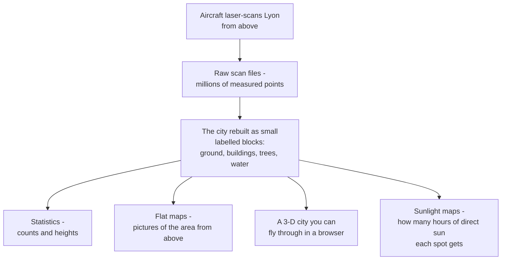
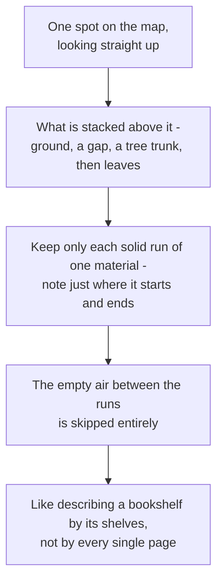
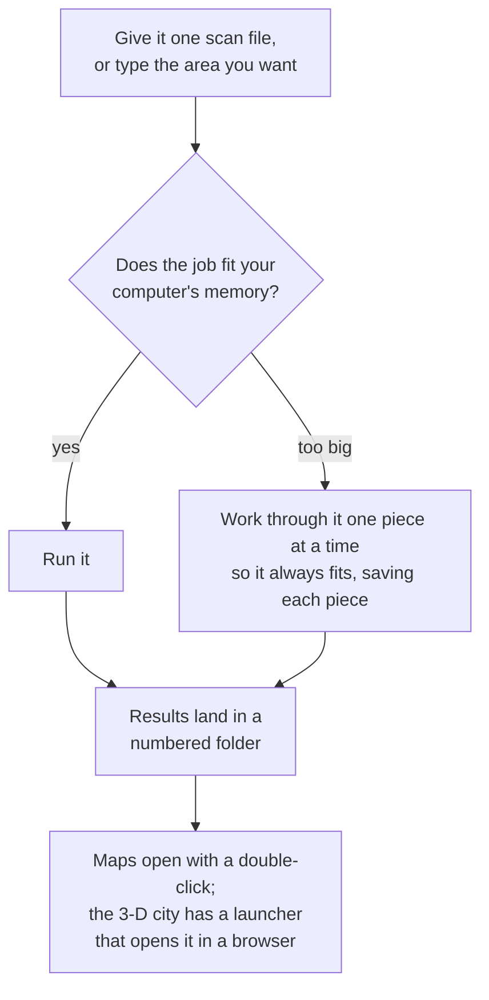

# Pipeline Overview - The Simple Version

This is a gentle, plain-language companion to the detailed diagrams. It is
written for project partners and anyone who is not a programmer. No code, no
jargon - just the idea of what the tool does and how you use it.

The tool takes laser scans of the city of Lyon and rebuilds the city as a
neat stack of small labelled blocks, then turns that into things you can
actually look at: numbers, flat maps, a 3-D city you can fly through, and
maps of how much direct sun each spot gets.

---

## 1. The big picture

Aircraft fly over Lyon firing a laser downward - this is called laser
scanning (LiDAR) - and record millions of points where the beam hits the
ground, rooftops, tree canopies, and water. The tool takes those raw scans
and rebuilds the city as a grid of small blocks, each one tagged with what it
is: ground, a building, a tree, or water. From that tidy model you can pull
out several kinds of results.

The sunlight maps count direct sunshine only: the beam from the sun itself,
blocked by roofs and thinned by leaves. Light that arrives from the rest of
the sky, or bounces off a wall, is not counted, and neither is cloud cover.

---

## 2. The one core idea

A model that stored every single block of a city would be enormous. The trick
that keeps it small is this: instead of listing every block, each spot on the
map only remembers the solid runs stacked above it - where a run of ground
ends, where a tree begins, where its leaves stop. The empty air between those
runs is not stored at all. It is like describing a bookshelf by its shelves,
not by cataloguing every single page.

The empty space still gets a meaning when the tool needs one. Air the laser
demonstrably passed through is one thing; the inside of a building the laser
never entered is another; and everything below the ground surface is a third.
That last one is a deduction, not a measurement: an airborne laser records
nothing underground, so the tool marks the space below the ground it did
measure as solid earth rather than claiming to have seen it.

---

## 3. What using it looks like

You start it in one of two ways: drop in a single scan file, or type the
coordinates of the area you care about. Before it does any heavy lifting, the
tool estimates whether the job will fit in your computer's memory, and if the
area is too big it works through it one piece at a time so it never runs out
of room. Each piece is saved as it finishes, so an interrupted job can be
picked up where it stopped instead of started again.

When it finishes, everything lands in a fresh numbered folder. The flat maps
are ordinary picture files you can open with a double-click. The 3-D city
arrives with its own double-click launcher, which starts a small local server
on your machine and opens the page in your browser; the console window that
opens is the server, and closing it stops it.

---

Want the full technical picture? See `pipeline_dataflow_diagram.md` - eight detailed diagrams of the same system.
