# Architecture du voxeliseur : vue d'ensemble pour la revue

Ce document répond à quatre questions en une lecture : comment les fichiers sont organisés, quelles classes existent et comment elles interagissent, comment une exécution s'enchaîne des tuiles LAZ aux résultats, et quelles fonctions suffisent pour relancer le pipeline ou reproduire les expériences. Il ne réorganise rien : il décrit le code tel qu'il est livré, avec les noms réels des modules et des fonctions, pour que la revue puisse aller directement aux endroits qui comptent.

Trois compléments l'accompagnent :

- la documentation générée par Doxygen (classes, fonctions, graphes d'appel, code source lié) : le site n'est pas versionné, il se régénère localement depuis `voxelising-python/docs/` avec `make_docs.cmd` (Windows) ou `make_docs.sh` (Linux), puis s'ouvre à `docs/doxygen/html/index.html` ;
- les diagrammes du dossier `voxelising-python/docs/reference/` (01 à 10 et 12), dont `10_classes_fr.svg` et `12_workflow_schema.svg` ;
- le guide long `voxelising-python/docs/reference/voxelizer-documentation.md` et le tutoriel `voxelising-python/how-to-use.md`, pour le détail que ce document ne répète pas.

Tout le code est en Python 3.13, dans un seul paquet, `voxelising-python/voxelizer/` : 49 modules, 27 635 lignes, 564 classes et fonctions, toutes documentées par une docstring.

## 1. Organisation des fichiers et des modules

```
voxelisation/
├── architecture.md                 ce document
├── README.md                       carte de la livraison et démarrage rapide
├── docs/                           documents d'accompagnement (conception,
│                                   journal des problèmes, sources)
└── voxelising-python/              le logiciel livré
    ├── voxelizer/                  le paquet : 49 modules (détail ci-dessous)
    ├── docs/                       Doxyfile, groups.dox, make_docs.cmd/.sh
    │   └── reference/              guides thématiques et diagrammes 01 à 10
    │                               et 12, rendus en .svg ; sources Mermaid
    │                               .mmd pour 06, 08, 10 et les éditions
    │                               `_fr` de 06b et 09a-c
    ├── diagrams/                   diagramme de flux de données du pipeline
    │                               (md, html) et sa présentation simple
    ├── inputs/                     quickhelpers/ (les deux inventaires JSON
    │                               des téléchargeurs) ; laz/ et ortho/ sont
    │                               les destinations vides du téléchargement
    ├── outputs/                    exécutions locales (vide livré ; les
    │                               sorties ne sont pas versionnées)
    ├── entire-lyon-outputs/        point de montage des exécutions
    │                               Métropole (vide livré)
    ├── scripts/                    lanceurs : run_area (.bat, .sh),
    │                               run_viewer (.bat, .sh), serve_run (.cmd, .sh)
    ├── docker/                     Dockerfile, docker-compose.yml,
    │                               docker-entrypoint.sh et les jumeaux
    │                               dockerdownload / dockerruncpu (.cmd, .sh)
    ├── execution-steps.md          référence CLI en 25 sections taguées
    ├── how-to-use.md               tutoriel pas à pas
    └── requirements.txt            dépendances épinglées (Python 3.13+)
```

Les 49 modules du paquet se lisent en cinq niveaux, du socle vers les points d'entrée. Le tableau ci-dessous en liste 48 : le quarante-neuvième est `voxelizer/__init__.py` (384 lignes), la façade du paquet, qui n'appartient à aucun niveau puisqu'elle les réexporte tous. La règle de niveaux vaut pour tous les imports de premier niveau : aucun module n'en importe un de niveau supérieur au chargement. Trois imports différés, placés dans un corps de fonction, remontent d'un niveau ou plus : `data_structures` (T1) importe `ground_index` (T2) dans la propriété `ground_idx`, qui construit l'indice de sol à la demande ; `preflight` (T0) importe `area` (T3) dans `_rects_and_counts_from_laz_dir`, qui réutilise `area.select_area_tiles` pour lister les tuiles de l'emprise ; `visualization` (T2) importe `pipeline` (T3) dans `write_area_maps`, qui y prend la liste des modes par défaut. Les deux premiers fermeraient un cycle s'ils étaient faits au chargement, `ground_index` important `data_structures` et `area` important `preflight` au premier niveau ; `visualization` et `pipeline` s'importent l'un l'autre de la même manière, chacun dans un corps de fonction (figure `docs/reference/06b_module_tiers_fr.svg` ; dépendances complètes dans `06_module_dependencies_fr.svg`).

| Niveau | Rôle | Modules (lignes) |
|---|---|---|
| T0 Socle | services de bas niveau, sans dépendance interne | `classes_config` (190) codes ASPRS et noms ; `io_laz` (286) lecture LAS/LAZ par morceaux ; `cli_common` (109) ; `run_utils` (115) ; `preflight` (629) estimateur mémoire et budget RAM ; `solar` (269) position du soleil ; `launchers` (265) ; `download_laz` (200), `download_orthos` (204), `_download_common` (190) |
| T1 Données | la structure et ses exporteurs | `data_structures` (1 825) **ColumnStore**, Column, Interval, regroupement, fusion ; `viz_common` (124) table de couleurs, enregistrement 32 octets et maille de boîte partagés par deux des trois exporteurs 3D ; `tileset_exporter` (1 073) 3D Tiles 1.1 ; `tiled_exporter` (1 246) flux tuilé pour le visualiseur web |
| T2 Algorithmes | tout ce qui transforme ou lit une structure | `voxelize` (454) quantifier, trier, réduire, compresser ; `ground_index` (268) indice de sol ; `decoder` (400) les trois formes de vide ; `resolve` (324), `denoise` (220), `absorb` (454) post-traitements optionnels ; `ray_trace` (346), `ray_columns` (168) parcours de rayons ; `transmittance` (340), `sun_hours` (232) ; `surface_model` (401) ; `reconstruct` (743) aller-retour LAS ; `visualization` (518) cartes ; `visualizer3d` (2 002) géométrie 3D, HTML, PLY ; `store_streaming` (883) statistiques en flux |
| T3 Orchestration | exécutions, étapes, isolation des pannes | `pipeline` (344) une tuile ; `area` (431) une emprise ; `sharding` (1 435) une emprise fragment par fragment ; `merge_streaming` (574) fusion hors mémoire ; `area_outputs` (461) ; `stage_runner` (345) chaque sortie dans son processus ; `shard_worker` (154) ; `column_diagnostics` (814), `shard_diagnostics` (689), `voxel_runner_diagnos` (1 329) diagnostics |
| T4 Consommateurs | les points d'entrée manipulés par l'utilisateur | `__main__` (369) verbes single et serve ; `area_cli` (918) **le pipeline complet** ; `tileset_cli` (249) ; `viz3d_cli` (427) ; `postprocess_cli` (449) ; `archive_cli` (444) ; `gui_area` (2 570) interface Tkinter ; `serve_voxel_html` (457), `serve_tiles` (314) serveurs locaux |

Pour la revue, six modules portent l'essentiel : `data_structures`, `voxelize`, `sharding`, `merge_streaming`, `decoder` et `area_cli`. Les autres sont des sorties, des diagnostics ou des interfaces.

## 2. Les classes et leurs interactions

Le code est organisé autour de fonctions et d'une seule classe centrale, plus des classes de données et quelques classes de service. Un diagramme de classes exhaustif serait trompeur ; celui-ci (`docs/reference/10_classes_fr.svg`) montre ce qui interagit réellement.



**ColumnStore** (`data_structures.py`) est la structure en colonnes de plages. Elle tient dans six tableaux NumPy : deux par colonne, `_keys` (uint64, la clé ix,iy) et `_off` (int64, le décalage vers les plages de la colonne) ; quatre par plage, `_zs` et `_ze` (int32, début et fin en indices de voxel, fin exclue), `_cl` (uint8, la classe) et `_ct` (int32, le nombre d'échos). Soit 16 octets par colonne et 13 par plage. Les colonnes sont triées par clé, les plages de chaque colonne par hauteur ; c'est une disposition CSR (compressed sparse row). Les opérations qui comptent : `from_intervals` construit la structure ; `grouped(max_gap_cells)` fusionne les plages voisines de même classe séparées d'au plus un écart donné, converti en cellules ; sans `--group-gap` il n'y a aucune limite d'écart, et 1,5 m est la valeur des exécutions enregistrées ; `merge` fusionne une structure dans une autre, tuile après tuile, et c'est ce qu'une exécution d'emprise en mémoire appelle à chaque tuile ; `merge_many` concatène des structures disjointes en un seul tri des clés ; `save`/`load` écrivent un `.npz`, `save_dir`/`load_dir` un dossier de tableaux lisibles en mémoire projetée (mmap), `swap_to_dir_mmap` bascule une structure vivante vers ce mode ; `stats` résume ; `ensure_dense_index` construit à la demande un index dense (ix, iy) vers colonne. La vue `columns` (classe `_ColumnsView`, un `Mapping`) rend chaque colonne comme un objet `Column` (quatre tableaux) qui itère des `Interval` (quatre entiers). Ces deux petites classes servent aux tests, aux diagnostics et à l'illustration ; le calcul de masse ne passe que par les six tableaux.

**Les plis de flux** (`store_streaming.py`) : `StatsFold`, `IntervalHistogramFold`, `TopNFold`, `CategoryFold`, `ClassFirstFold` reçoivent la structure par lots de colonnes (`add`) et rendent un résultat (`result`). Ils permettent de calculer statistiques, histogrammes et échantillons sur une structure projetée en mémoire sans jamais la charger entière.

**Le parcours de rayons** (`ray_trace.py`, `ray_columns.py`) : `ColumnGridDDA` avance un rayon cellule par cellule (algorithme DDA) à travers la grille et rend un `RayHit` ; sa configuration est `DDAConfig`. `CeilingDDA` en hérite et ajoute le plafond par colonne. Les deux lisent la structure à travers le décodeur, donc le vide y est qualifié (air mesuré, intérieur opaque, sous-sol).

**La physique** (`transmittance.py`, `solar.py`, `sun_hours.py`) : `Extinction` porte le coefficient d'extinction par classe (`k`, avec un défaut opaque pour une classe absente de la table) ; `TransmittanceResult` et `SunHoursResult` sont des résultats, et c'est `TransmittanceResult` qui porte le test d'opacité (`blocked`, vrai quand la transmittance est tombée à zéro) ; `SunPosition` est une position du soleil avec `is_up`. Ces post-traitements ne font pas partie de la chaîne livrée ; ils montrent ce que la structure permet.

**Les services** : `ShardSet` (`shard_diagnostics.py`) décrit les fragments d'une exécution et les recharge ; `DiagnosticsMonitor` (`voxel_runner_diagnos.py`) enregistre mémoire, CPU et incidents d'une exécution ; `RamBudgetExceeded` (`preflight.py`) est l'exception levée quand l'estimateur préalable dépasse le budget mémoire.

## 3. Le flux d'exécution

Le schéma qui appelle quoi, dans quel ordre, avec quelles données, pour les deux commandes qui comptent (`voxelizer single` et `voxelizer.area_cli area`) est le suivant (notice : `docs/reference/12_workflow_schema.md`) :



Les boîtes y sont un graphe au niveau des fonctions : celles que ces deux commandes appellent réellement, plus les points d'entrée des processus enfants. Les fonctions des six modules essentiels cités à la fin de la section 1 en sont un sous-ensemble, 23 des 47 boîtes de fonction, marquées d'un liseré doré épais ; les 24 autres appartiennent à 19 modules de plus et à un script du dépôt. Le dessin porte en outre 12 cylindres d'artefacts, dont deux en pointillés parce qu'une exécution propre les efface, et deux parallélogrammes pour les données d'entrée. C'est un écart délibéré à la règle de la revue, qui demandait une boîte par module essentiel : six boîtes ne peuvent pas montrer ce qui appelle quoi à l'intérieur du flux. Deux comptes de modules, parce que ce sont deux nombres différents : 25 modules du paquet possèdent une boîte ici, les six essentiels et les 19 autres, et trois de plus (`visualizer3d`, `ray_trace`, `solar`) sont nommés dans le texte d'une boîte sans en avoir une à eux ; une exécution `area` par défaut, sans `--download` ni `--shard`, entre dans une fonction de 16 modules du paquet, dont quatre ne sont nommés nulle part dans le dessin (`cli_common`, `run_utils`, `classes_config`, `viz_common`). Les flèches portent les données échangées et se lisent de cinq façons : trait plein pour un appel de la voie par défaut, trait épais pour un passage de données entre deux boîtes qui ne s'appellent pas, tirets pour une branche prise sous l'option nommée sur l'étiquette, flèche sortant d'un cylindre pour une lecture de fichier, flèche terminée par une croix pour une suppression. Le côté lecture
(décodeur, rayons, solaire) y est isolé parce qu'il ne construit jamais de structure.

Une exécution complète est `python -m voxelizer.area_cli area ...`. Elle enchaîne :

1. **Sélection** : `area.select_area_tiles` retient les tuiles LAZ dont l'emprise coupe la boîte demandée (`--xmin --ymin --xmax --ymax`).
2. **Lecture** : `io_laz.read_laz_chunks` lit chaque tuile par morceaux (coordonnées, classe), pour que le tampon de points reste borné.
3. **Voxelisation** (`voxelize.voxelize_laz_chunked`) : `_cells_from_points` quantifie chaque point en indices entiers (ix, iy, iz), trie par colonne puis par hauteur, et réduit les points tombés dans la même cellule avec la même classe en une entrée avec son nombre d'échos ; `_store_from_cells` compresse verticalement les cellules contiguës de même classe en plages et construit un `ColumnStore`. Les cellules vides ne sont jamais écrites.
4. **Fragmentation** (`sharding.run_area_sharded`, option `--shard`) : chaque tuile est voxelisée à son tour et écrite comme fragment `.npz` sous `shards/` ; avec `--isolate-tiles`, chaque tuile passe dans un processus enfant (`shard_worker`) et une panne est confinée à cette tuile (`failed_tiles.json`) ; `shards/run_config.json` refuse toute dérive de paramètres ; `--resume-shards` reprend une exécution en réutilisant les fragments validés.
5. **Fusion** : en mémoire par `ColumnStore.merge`, tuile après tuile dans `area.process_area`, ou hors mémoire par `merge_streaming.merge_shards_streaming`, qui planifie des bandes de colonnes (`plan_bands`, budget `--merge-band-intervals`) et n'a jamais plus d'une bande en mémoire. Les deux voies donnent la même structure octet pour octet (vérifié sur le carré d'exemple).
6. **Regroupement** : `ColumnStore.grouped` applique la tolérance `--group-gap`. L'option n'a pas de limite par défaut : l'argparse d'`area_cli` la met à `None`, ce que le regroupement traduit par un écart illimité ; 1,5 m est la valeur des exécutions enregistrées, et elle doit être passée explicitement pour les reproduire. La structure non regroupée est `area_raw.npz`, écrite avant le regroupement et conservée par `--keep-area-raw` ; `--keep-raw-store` garde `store_raw/`, qui porte la structure regroupée.
7. **Persistance** : sur la voie par défaut, celle des étapes isolées, la structure regroupée est écrite sur disque en `store_raw/` (dossier de tableaux lisibles en mémoire projetée) et c'est de là que chaque sortie la relit. Les produits ne sortent pas tous du même écrivain : l'étape `persist_npz` écrit `area.npz` et `area_manifest.json`, l'étape `stats` écrit `stats.txt`, et `stages.json` est écrit par le parent, `area_outputs._write_outputs_isolated`, une fois toutes les étapes rendues. Sous `--no-isolate-stages` (étape 8), les mêmes produits sont écrits depuis la structure en mémoire, sans `store_raw/`.
8. **Sorties** : `area_outputs._write_outputs_isolated` lance chaque sortie dans son propre processus, par `_run_stage`, qui démarre un `python -m voxelizer.stage_runner` par étape ; `stage_runner` est donc l'enfant, pas le lanceur, et ne fait qu'une étape, celle que sa ligne de commande nomme. Une panne coûte ainsi un produit et jamais l'exécution. Sous `--no-isolate-stages`, `area_outputs._write_outputs` écrit les mêmes produits dans le processus courant. Les produits sont les cartes PNG (`area_outputs`, `visualization`), les diagnostics de colonnes (`column_diagnostics`) et la structure finale `area.npz` et, sur demande (`--viz3d-stream`), le flux pour le visualiseur web three.js (`tiled_exporter.write_tiled_payload`, servi par `serve_voxel_html`). Les autres sorties se produisent ensuite depuis `area.npz`, par leurs propres commandes : LAS/LAZ (`python -m voxelizer.reconstruct to-laz`, aller-retour exact vérifiable) et le tileset 3D Tiles (`python -m voxelizer.tileset_cli from-store`, puis `serve_tiles` : CesiumJS, iTowns).

**Le décodeur** (`decoder.classify_voxel`, `classify_gap`, `class_at_slice`, `interval_gap_type`, avec `ground_index.compute_ground_indices`) n'intervient pas dans la construction : il lit la structure à la demande et qualifie chaque voxel vide en air mesuré, intérieur opaque ou sous-sol, à partir d'un seul nombre par colonne, l'indice de sol. Tout calcul physique (rayons, transmittance, ensoleillement) passe par lui.

Le même cœur sert trois façons d'entrer : une tuile seule (`python -m voxelizer single`, `pipeline.process_single_tile`), une emprise en mémoire (`area.process_area`, `process_area_streamed`) et une emprise fragmentée (`sharding.run_area_sharded`). L'interface graphique `gui_area` compose la même ligne de commande.

## 4. Les fonctions nécessaires pour reproduire

| Besoin | Fonction | Ligne de commande |
|---|---|---|
| Construire une emprise, structure finale et sorties | `area_cli.run_area` → `sharding.run_area_sharded` ou `area.process_area` | `python -m voxelizer.area_cli area ...` |
| Fusionner des fragments existants hors mémoire | `merge_streaming.merge_shards_streaming` | `python -m voxelizer.merge_streaming --shards-dir DIR --out-store-dir DIR` |
| Regrouper les plages avec une autre tolérance (sans l'option, aucune limite d'écart ; 1,5 m est la valeur des exécutions enregistrées) | `ColumnStore.grouped(max_gap_cells)` | `area_cli ... --group-gap 1.5` |
| Exporter et vérifier LAS/LAZ | `reconstruct.store_to_laz`, `store_from_laz`, `verify_roundtrip`, `verify_exact` | `python -m voxelizer.reconstruct to-laz ... --mode exact --verify` |
| Exporter en 3D Tiles | `tileset_exporter.convert_to_3d_tiles_lod` | `python -m voxelizer.tileset_cli from-store area.npz --out-dir tiles` |
| Servir les visualiseurs | `serve_voxel_html.main`, `serve_tiles.main` | `python -m voxelizer serve DIR --kind stream` (ou `--kind tiles`) |
| Lire le vide d'un voxel | `decoder.classify_voxel`, `ground_index.compute_ground_indices` | (bibliothèque) |
| Estimer la mémoire avant de lancer | `preflight.estimate_area_run`, `preflight.format_estimate` | `area_cli ... --preflight-only` (imprime l'estimation et sort) |
| Borner la mémoire pendant l'exécution | garde-fou sur la RSS dans la boucle de tuiles, `preflight.check_rss_budget` (levée de `RamBudgetExceeded`) | `area_cli ... --max-rss-mb N` |
| Re-vérifier les onze faits du rapport | `code_verification/run_all.py` (monorepo VCity, hors livraison) | `python run_all.py` (depuis `code_verification/`, dans le monorepo) |

### 4.1 Environnement

Python 3.13 ou plus récent (3.11.9 corrompt le tas de l'interpréteur sur ce code, voir `how-to-use.md` §12). Depuis `voxelising-python/` :

```
python -m venv .venv
.venv\Scripts\python.exe -m pip install -r requirements.txt
```

Ou en conteneur, avec les mêmes chemins montés (`inputs/`, `outputs/`, `entire-lyon-outputs/`) :

```
docker compose -f docker/docker-compose.yml build
docker compose -f docker/docker-compose.yml run --rm voxelisation python -m voxelizer --help
docker compose -f docker/docker-compose.yml up voxelisation-gui        # interface graphique sur http://localhost:6080
```

Les tuiles LAZ de la Métropole de Lyon (campagne 2023, 2 842 tuiles, EPSG:3946) se téléchargent par origine de tuile depuis l'inventaire fourni dans `inputs/quickhelpers/` :

```
python -m voxelizer.download_laz --xmin-start 1831000 --xmin-end 1832000 --ymin-start 5176500 --ymin-end 5177500 --laz-dir inputs/laz
```

### 4.2 Le carré d'exemple (expérience E1 du rapport)

Quatre tuiles de 500 m à l'ouest de Lyon (18310_51765, 18310_51770, 18315_51765, 18315_51770), soit l'emprise 1 831 000 à 1 832 000 en x et 5 176 500 à 5 177 500 en y, à 0,5 m, tolérance de regroupement 1,5 m. Ces paramètres sont ceux que l'exécution enregistre elle-même : `area_manifest.json` et `shards/manifest.json` portent l'emprise, les tailles de cellule et `group_gap_m` (le bloc de provenance construit par `run_utils.make_provenance`), tandis que `shards/run_config.json` ne retient que ce dont la dérive interdit une reprise (bbox, clip, cell_xy, cell_z, keep_classes, run_order) ; la ligne de commande ci-dessous les reproduit.

```
python -m voxelizer.area_cli area --xmin 1831000 --ymin 5176500 --xmax 1832000 --ymax 5177500 --laz-dir inputs/laz --output-dir outputs/E1/area_output --cell-xy 0.5 --cell-z 0.5 --group-gap 1.5 --keep-raw-store
```

La même emprise fragmentée, pour vérifier que le résultat est identique :

```
python -m voxelizer.area_cli area --xmin 1831000 --ymin 5176500 --xmax 1832000 --ymax 5177500 --laz-dir inputs/laz --output-dir outputs/E1_shard/area_output --cell-xy 0.5 --cell-z 0.5 --group-gap 1.5 --shard --merge-shards --isolate-tiles
```

Valeurs de référence (rapport, section E1) : 52 705 942 points lus ; 3 995 579 colonnes occupées sur 4 000 000 ; 6 630 970 plages avant regroupement, 5 830 031 après (12,1 % de moins, 458 583 colonnes modifiées) ; structure de 140 Mo ; construction en une passe 88 s, en quatre fragments 95 s ; six tableaux identiques élément par élément entre les deux voies.

### 4.3 La Métropole entière

Six exécutions Métropole ont été mesurées (2 m, 1 m et 0,5 m, chacune brute et regroupée ; détail dans le rapport et dans `tests/T160/REPORT.md` du monorepo VCity). Elles ne sont pas versionnées : `entire-lyon-outputs/` est livré vide, c'est le point de montage où les exécutions persistent. Aucun fichier livré n'enregistre donc l'emprise de ces exécutions ; `XMIN YMIN XMAX YMAX` se lisent de l'inventaire `inputs/quickhelpers/nuage-de-points-lidar-2023-de-la-metropole-de-lyon.json`, dont les champs `x_min`, `y_min`, `x_max` et `y_max` sur les 2 842 tuiles donnent l'enveloppe 1 831 000 à 1 861 000 en x et 5 151 500 à 5 195 500 en y. Le lancement documenté :

```
docker compose -f docker/docker-compose.yml run --rm voxelisation python -m voxelizer.area_cli area --xmin XMIN --ymin YMIN --xmax XMAX --ymax YMAX --laz-dir inputs/laz --output-dir entire-lyon-outputs/Run1/area_output --shard --resume-shards --isolate-tiles
```

Les fragments persistent à travers les conteneurs ; `--resume-shards` reprend sans recalculer les tuiles déjà validées, et `shards/run_config.json` refuse toute dérive de paramètres. La fusion finale se fait par bandes, en mémoire bornée (pic mesuré 18 à 27 Go selon la résolution, rapport tableau des exécutions).

### 4.4 Les sorties

```
python -m voxelizer.reconstruct to-laz outputs/E1/area_output/area.npz outputs/E1/area.laz --mode exact --verify
python -m voxelizer.reconstruct verify outputs/E1/area_output/area.npz outputs/E1/area.laz
python -m voxelizer.tileset_cli from-store outputs/E1/area_output/area.npz --out-dir outputs/E1/tiles --tile-m 100
python -m voxelizer serve outputs/E1/tiles --kind tiles --open-viewer cesium
python -m voxelizer.area_cli area ... --viz3d-stream --tile-m 64      # flux pour le visualiseur three.js
python -m voxelizer.serve_voxel_html outputs/E1/area_output --open
```

### 4.5 Les expériences et les tests

La suite de tests, les protocoles d'étude enregistrés et les onze expériences de re-vérification ne font pas partie de cette livraison : ils restent dans le monorepo VCity (`Projects/IArbre/Stage-voxelisation`), où `VoxelisingPython/tests/` tient 48 fichiers `test_*.py` (pytest), `code_verification/` les onze expériences qui re-vérifient sur données réelles les faits chiffrés du rapport (corpus, égalité par morceaux, aller-retour, 16 + 13 octets, équivalence des parcours de rayons, invariants de transmittance, ajustement de l'extinction, géométrie solaire, raccourci du plafond, conservation des comptes par les encodeurs, ensoleillement) et `Experiments/` les protocoles figés tels qu'ils ont produit les résultats enregistrés. La suite y donnait 671 réussis et 2 ignorés au moment de la livraison.

Leur lancement demandait le corpus LAZ complet dans le miroir local désigné par `_common.LAZTEMP` (exp01 lit tous les en-têtes, exp02 à exp04 une tuile réelle) et les structures régénérées en `outputs/Sweep/<résolution>/area.npz` et `outputs/StratN10/<zone>/1p0_1p0/area.npz` ; seules exp08 et la suite pytest ne demandaient aucune donnée (``python -m pytest tests -q``, quelques minutes selon la machine). Le détail est dans les `README.md` de ces deux dossiers du monorepo.

## 5. La documentation générée

Le site Doxygen regroupe, pour les 49 modules : la liste des classes et des fonctions avec leur docstring, le graphe d'appel et d'appelants de chaque fonction, les graphes de dépendances entre modules, le code source annoté et un moteur de recherche. La page d'accueil est ce document. Le site généré n'est pas versionné : pour le produire après une modification du code, depuis `voxelising-python/docs/` : `make_docs.cmd` (Windows, Doxygen et Graphviz installés par winget) ou `make_docs.sh` (Linux, `apt install doxygen graphviz`), puis ouvrir `docs/doxygen/html/index.html`. Le fichier `Doxyfile` est versionné ; les avertissements vont dans `doxygen_warnings.log`. La documentation générée tire toute sa prose des docstrings, un commentaire `#` n'étant pas extrait, et `PYTHON_DOCSTRING = NO` dans le `Doxyfile` est ce qui fait rendre le balisage `@param` d'une docstring en tableau plutôt qu'en texte brut : une référence centralisée sur les fonctions de reproduction passe donc par des tableaux de paramètres écrits dans la source. Ces tableaux sont portés par 58 définitions réparties sur 24 modules, dont 45 fonctions de module, 12 méthodes de classe et une classe d'exception, et totalisent 344 lignes `@param`. Le volume se mesure : dans les six modules essentiels, les docstrings occupent 1 676 lignes contre 1 380 dans l'arbre de référence d'avant le nettoyage, soit 296 lignes de plus, 21,4 % (convention retenue : le nombre de lignes physiques couvertes par chaque littéral de docstring, guillemets compris, module, classes et fonctions cumulés). Les récits d'incidents ont été retirés des docstrings du cœur ; ce qui reste est le volume de ces tableaux, et il est assumé.

Les docstrings sont en anglais, en prose libre, dans le style du code existant ; les 199 définitions qui en manquaient ont été complétées le 11 septembre 2026 sans toucher au code (vérification : arbre syntaxique identique une fois les docstrings retirées, suite de tests inchangée).

La navigation du site commence par cinq Sujets, T0 à T4, qui reprennent les niveaux du tableau de la section 1 ; chaque module y figure avec sa description d'une ligne, et chaque page de module liste ses fonctions avec la leur. Les tableaux de paramètres couvrent les fonctions de reproduction, celles qu'il faut connaître pour relancer le pipeline et reproduire les expériences, et non les 539 fonctions du paquet. Leur portée dépasse la table de la section 4, qui ne nomme pas de méthode de classe : 12 des 58 définitions en sont (11 sur `ColumnStore`, une sur `ColumnGridDDA`), et d'autres relèvent du post-traitement, des diagnostics ou de l'export (`absorb`, `denoise`, `resolve`, `column_diagnostics`, `visualizer3d`, `tiled_exporter`, `tileset_exporter`). Pour les fonctions hors de cet ensemble, la description en prose du docstring reste la référence.
## 6. Où trouver le reste

| Question | Document |
|---|---|
| Pourquoi ces choix (plages, six tableaux, regroupement, tuile par tuile, trois formes de vide) | `docs/design-decisions.md` ; rapport, section 4 |
| Les problèmes rencontrés et leur résolution, dans l'ordre | `docs/problem-solving.md` |
| Toutes les options de ligne de commande et les .bat | `voxelising-python/docs/reference/cli_and_bat_reference.md`, `execution-steps.md` |
| Le tutoriel pas à pas | `voxelising-python/how-to-use.md` |
| La conception de l'aller-retour LAS | `voxelising-python/docs/reference/laz_roundtrip_design.md` |
| Les visualiseurs (flux three.js, 3D Tiles) | `voxelising-python/docs/reference/visualizer3d_workflow.md`, `09a`, `09b`, `09c` |
| Les expériences enregistrées | `Experiments/` et `code_verification/` dans le monorepo VCity (`Projects/IArbre/Stage-voxelisation`), hors de cette livraison |
| Les sources | `docs/bibliography-and-references.md` |
| Pourquoi les trois visualiseurs, les deux modèles three.js, l'interface graphique et les arbres de validation sont conservés | `voxelising-python/docs/reference/02_visualization_formats.md` |

## 7. Écarts connus entre la documentation et le code

Relevés en préparant ce document. Les comptes de tests périmés et l'exemple `serve` du README ont été corrigés le 11 septembre 2026 ; les deux points suivants touchent au code d'expériences enregistrées du monorepo VCity (hors de cette livraison) et sont laissés en l'état :

- `Experiments/README.md` signale lui-même que les chemins par défaut `outputs/Sweep/...` de `run_encoders.py`, `run_ray_benchmark.py`, `run_transmittance_probe.py` et `derive_extinction.py` ne se résolvent plus sans les adapter (les scripts sont figés tels qu'ils ont produit les résultats enregistrés) ;
- `voxelizer.download_laz` prend l'inventaire fourni par défaut, alors que `area_cli --download` et `--stream` exigent `--json` explicitement (passer `--json inputs/quickhelpers/<inventaire>.json`) ;
- les résultats enregistrés du balayage (`Experiments/Sweep2026-07-22Exp/`) ne sont pas versionnés ; `encoders.log` et `encoders_summary.json`, qui le sont, enregistrent l'issue de chaque passe, et le script `run_encoders.py` les régénère.
