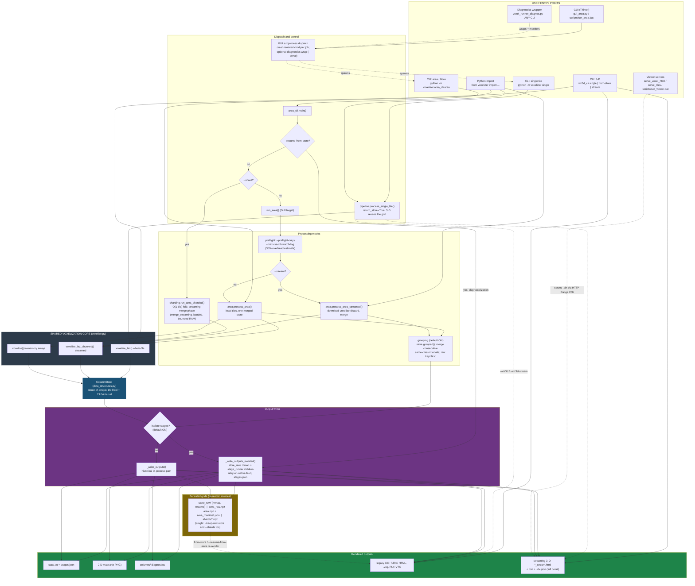
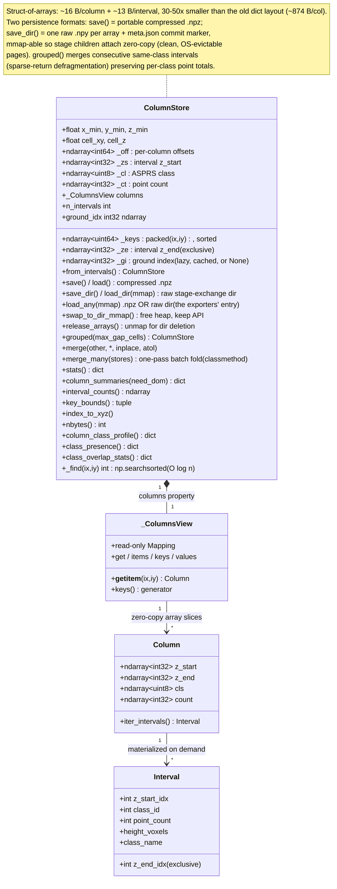
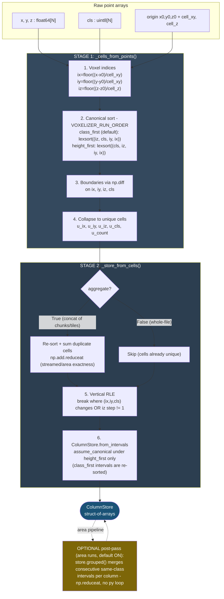
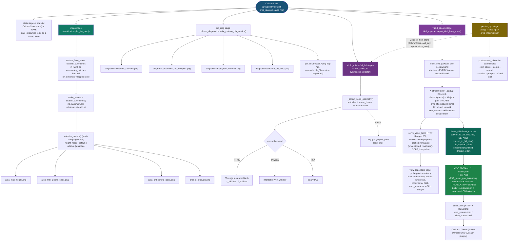
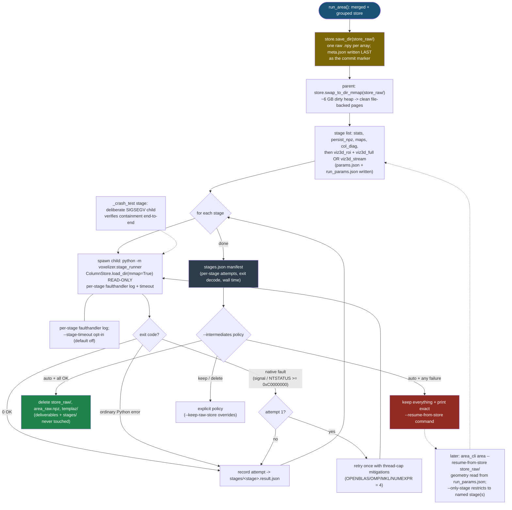
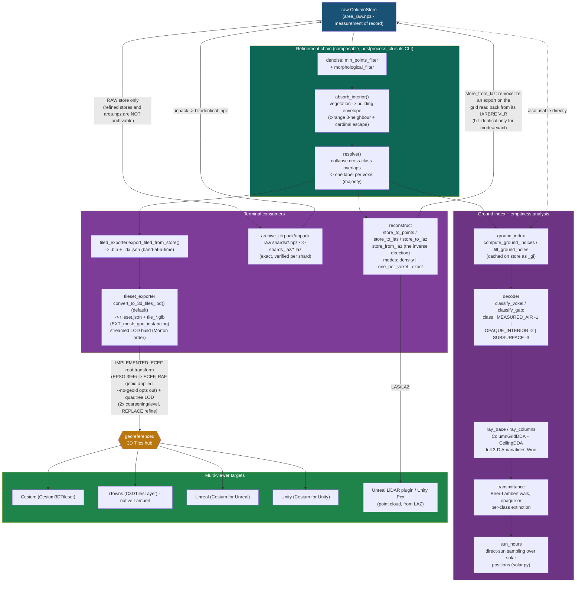

# Voxelizer - Pipeline & Data-Flow diagrams

Eight Mermaid diagrams describing the IA.rbre LiDAR voxelizer end to end:
system architecture, the struct-of-arrays data model, the two-stage numpy
core, the three voxelization paths (whole-file / streamed / sharded), the
stage-based output & visualization fan-out (including the full-detail
streaming 3-D viewer and the 3-D Tiles export), the module import graph, the
per-stage crash-isolation & recovery flow, and the post-voxelization
refinement / analysis / reconstruction layer with its multi-viewer export
targets (3-D Tiles -> Unreal / Unity / Cesium / iTowns).

GitHub renders the Mermaid blocks below natively. For an interactive standalone
page, open **`pipeline_dataflow_diagram.html`**.

Provenance of the rendered SVGs in `docs/reference/`: diagrams 01-05 and 07 are
rendered from the mermaid blocks in this document and ship without a
standalone `.mmd`; 06, 06b, 08 and 09a-c ship a `.mmd` beside the `.svg`
(06b and 09a-c in their `_fr` editions), and
of those 06, 06b and 09a-c are generated from the package's own source while
08 is kept in step with diagram 8 below.
For usage instructions, see **`how-to-use.md`**.
For a plain-language, non-technical tour of the whole pipeline, read **`pipeline_overview_simple.md`**.

---

### 1. Top-Level System Architecture

The complete journey from the **seven ways into this flow** - the single-tile CLI, the area CLI, the 3-D CLI, the Tkinter GUI, the viewer server, the standalone diagnostics wrapper, and direct Python import - through dispatch, the RAM pre-flight, and the shared voxelization core, into the `ColumnStore`, the interval-grouping post-pass, the **stage-isolated output writer** (default), the persisted grids, and the rendered outputs - including the full-detail **streaming 3-D viewer** served over HTTP Range/206. Dotted edges are lazy/optional paths (GUI subprocess spawns, diagnostics wrapping, `from-store`/`--resume-from-store` re-rendering).

The count is scoped to this diagram and does not contradict the report's Section 4.1, which counts **five delivery entry points** over the voxelization core: the single-tile CLI, the area CLI, the GUI, the 3-D CLI and the 3D Tiles exporter. Four of those five are drawn above. The fifth, the exporter (`tileset_cli`), is absent here because it enters downstream of the persisted store rather than through this dispatch path - it appears in diagrams 5, 6 and 8, as do the other downstream store consumers, `postprocess_cli` (the refinement CLI over a saved store) and the tileset server `serve_tiles`. The three extra members above - the viewer servers, the diagnostics wrapper and direct Python import - are ways into this flow rather than separate delivery entry points: the servers serve already-written payloads, the diagnostics wrapper wraps another entry point, and direct import is the library surface.

---

### 2. Data Structures Hierarchy & Memory Model

The memory-efficient **struct-of-arrays** layout, now with **two persistence formats**: `save()`/`load()` (portable compressed `.npz`) and `save_dir()`/`load_dir(mmap=True)` (raw stage-exchange directory - one plain `.npy` per array plus a `meta.json` commit marker - that stage children attach to zero-copy). `load_any()` takes either form, which is what the exporters (`tileset_cli from-store`, `viz3d_cli from-store` / `stream`, `postprocess_cli`) call. `swap_to_dir_mmap()` lets the parent free its heap copy while keeping the store readable; `grouped()` merges consecutive same-class intervals (the sparse-return defragmentation step).

---

### 3. Two-Stage Voxelization Core Algorithm

The fully vectorized numpy core, unchanged in semantics: Stage 1 (`_cells_from_points`) turns raw points into canonically-sorted unique voxel cells; Stage 2 (`_store_from_cells`) optionally re-aggregates duplicate cells (what makes the streamed and area paths byte-for-byte identical to the whole-file path), run-length-encodes in *z*, and builds the store with no Python loop over points. Area runs now apply an **optional grouping post-pass** (default ON) that merges consecutive same-class intervals via `np.reduceat`. The cell sort order is switchable: the default `class_first` forms maximal per-class runs by construction, while `VOXELIZER_RUN_ORDER=height_first` walks z-major, so a same-class run splits where another class interleaves in the same voxels. `height_first` stays fully supported as the compatibility order - every store written before the switch records it in its provenance - and per-voxel content is identical under both orders.

---

### 4. Voxelization Paths & Sharded Pipeline

The three ways point data reaches a `ColumnStore`: **A** whole-file, **B** streamed one file at a time (bounded by one chunk of raw points, with per-chunk bbox clipping and class filtering), and **C** the sharded area pipeline (O(1 tile) RAM, never holding one merged store; the 3-D full view is assembled shard-by-shard). `process_area` runs Path B per tile and merges the disjoint tiles under the `--max-rss-mb` watchdog - a budget breach aborts cleanly and still writes PARTIAL outputs. Path C is also crash-resilient: `--resume-shards` reuses lattice-validated shards from an interrupted run (guarded by `shards/run_config.json`; `_tmp_*.npz` leftovers of interrupted atomic writes are swept at startup), `--isolate-tiles` voxelizes each tile in a `shard_worker` child so a native LAZ-decoder crash is contained and recorded in `shards/failed_tiles.json`, and `--retry-lazrs` grants one second-opinion decode with the single-thread `lazrs` backend (`laszip` stays the pinned default everywhere else). The merge phase is `merge_streaming`: a band-partitioned out-of-core merge whose anonymous memory is bounded by the band budget regardless of store size; without `--merge-shards`, `shard_diagnostics` computes the full stats and columns/ surface directly from the shards, byte-identical to the merged-store output. Background: `problem-solving.md` sections 4.1 and 6.4, plus the tile-160 incident report (`tests/T160/REPORT.md`), which works a corrupted-tile case end to end. A fourth, derived entry point is `reconstruct.store_from_laz`: it reaches a store through Path A or B (`chunk_size` decides which) but takes the grid from the file's `IARBRE` VLR instead of deriving an origin from the points - see section 8 for that return edge.

```mermaid
flowchart LR
    File[(".laz / .las file")]

    subgraph PathA ["Path A: Whole-file (voxelize_laz)"]
        A1["io_laz.read_laz(path)"] --> A2["voxelize()"] --> A3["_cells_from_points()"] --> A4["_store_from_cells(aggregate=False)"]
    end

    subgraph PathB ["Path B: Streamed one file (voxelize_laz_chunked)"]
        B1["read_laz_header() -> origin"] --> B2["read_laz_chunks()"]
        B2 --> B3["per chunk: clip_bbox + keep_classes<br>then _cells_from_points()"]
        B3 --> B4["concatenate cell parts"]
        B4 --> B5["_store_from_cells(aggregate=True)"]
    end

    subgraph PathC ["Path C: Sharded area (run_area_sharded) - O(1 tile) RAM, crash-resilient"]
        C0{"--resume-shards and<br>matching shard on disk?"}
        C0 -- "yes: reuse" --> CR["ColumnStore.load(shards/&lt;stem&gt;.npz)<br>lattice validated; no download, no decode"]
        C0 -- no --> C1["download / local tile"]
        C1 --> CI{"--isolate-tiles?"}
        CI -- no --> C2["voxelize_laz_chunked() = Path B"]
        CI -- "yes: child process" --> CW["shard_worker subprocess<br>a native decoder crash costs ONE tile:<br>retry once (--retry-lazrs), else<br>record in failed_tiles.json + continue"]
        C2 --> C3["atomic save: _tmp_*.npz -> shards/&lt;stem&gt;.npz"]
        CW --> C3b["parent reloads the child's shard"]
        C3 --> C4["aggregates.add(tile.stats())"]
        C3b --> C4
        CR --> C4
        C4 --> C5["viz.scatter_summaries(mosaic)"]
        C5 --> C6["del tile (free RAM)"]
    end

    File --> PathA
    File --> PathB
    File --> PathC

    A4 --> OutA(["ColumnStore (one tile)"])
    B5 --> OutB(["ColumnStore (one tile)"])
    OutB -. "process_area: merge disjoint tiles<br>+ check_rss_budget watchdog<br>(RamBudgetExceeded -> PARTIAL outputs)" .-> Merged(["one area ColumnStore<br>then grouped() by default"])

    C6 --> C7["manifest.json + mosaic PNGs"]
    C7 --> CM{"--merge-shards?"}
    CM -- "no (shard-only)" --> CD["shard_diagnostics: columns/ + stats<br>computed from the shards directly,<br>byte-identical to the merged path"]
    CD --> OutC(["shards/*.npz + partial-safe stats;<br>3-D: ROI from intersecting shards,<br>full view streamed shard-by-shard"])
    CM -- yes --> C8["merge_streaming: band-partitioned<br>out-of-core merge -> store_raw/<br>anonymous peak bounded by the band<br>budget, independent of store size"]
    C8 --> C9(["store_raw/ + full stage outputs<br>(bounded-RAM streaming reductions)"])

    style PathA fill:#2874a6,color:#fff
    style PathB fill:#1e8449,color:#fff
    style PathC fill:#7d3c98,color:#fff
    style Merged fill:#1a5276,color:#fff
```

---

### 5. Output & Visualization Pipelines

How one `ColumnStore` fans out into every artifact, now organized as **named stages** (each runnable in isolation): `stats`, `persist_npz` (the `from-store` re-render source), `maps` (four modes, pixel-budget guarded, three height modes), `col_diag` (four diagnostic figures incl. by-class representatives, plus capped per-column PNGs), the legacy `viz3d_roi`/`viz3d_full` viewers (vectorized collector, `.vxg` cache, PLY, PyVista), and the **`viz3d_stream`** stage - the tiled full-detail exporter whose `.bin`+`.idx.json` payload is served by `serve_voxel_html` (HTTP Range/206) to a view-dependent page with probe-point residency, eviction hysteresis, and an impostor far field. On a memory-mapped store the stats, maps and column-diagnostics stages take bounded-RAM streaming reductions (`store_streaming`); exported tilesets are served by `serve_tiles`, and generated `view_*.cmd` launchers sit beside each viewer output; `postprocess_cli` refines a saved store from the command line.

---

### 6. Module Dependency Graph

Static import boundaries. **An arrow `A --> B` means "A imports B."** Dotted edges are lazy in-function imports - either genuine cycle breaks (`area`<->`preflight`, `stage_runner`->`area_cli`, and the `data_structures`<->`ground_index` ground-cache cycle) or optional-dependency deferrals (3-D, matplotlib, laspy).

**`area_outputs.py`** holds the output writers and the per-stage isolation machinery that `area_cli` and `sharding` both need. That is what retired the old `area_cli`<->`sharding` cycle - `sharding` no longer imports `area_cli` at all, and the one remaining edge between the hubs (`area_cli` -> `sharding`, lazy) is a plain one-way dispatch. Also present: the **refinement / analysis / reconstruction layer** (`resolve`, `denoise`, `absorb`, `ground_index`, `decoder`, `ray_trace`, `reconstruct`) and the **3-D Tiles exporters** (`tileset_exporter`, `tileset_cli`) - all top-level modules that build only on `data_structures`, `classes_config`, and each other. `reconstruct` additionally imports `io_laz` (it reads files back now, not just writes them), and `archive_cli` sits on top of `reconstruct` + `data_structures` + `io_laz` (it takes the archive's default EPSG from `io_laz.DEFAULT_EPSG`).

New since the last revision, six modules of the streaming and serving generation plus the ray-query family: **`merge_streaming.py`** is the band-partitioned out-of-core merge that `sharding` dispatches to (and `area_cli` imports eagerly for its `--merge-band-intervals` default); **`store_streaming.py`** holds the bounded-RAM reductions that the stage children, the map rasters, the column diagnostics and the postprocess CLI use on memory-mapped stores; **`shard_diagnostics.py`** computes the full columns/ + stats surface from shards without merging them; **`serve_tiles.py`** serves exported tilesets (reached via `python -m voxelizer serve`); **`launchers.py`** writes the one-click `view_*.cmd` files beside a run's viewers and imports nothing from the package; **`postprocess_cli.py`** is the CLI over the refinement chain. The ray-query family: `ray_columns` (the ceiling-bounded DDA, over `ray_trace`), `transmittance` (the Beer-Lambert walk, over `decoder`), and `sun_hours` (solar-position sampling over `ray_columns` + `transmittance` + `solar`). The generated `06_module_dependencies.mmd` is the authoritative import graph (48 modules, 147 edges); this drawing stays curated and grouped.

```mermaid
flowchart TD
    %% Convention: A --> B means "A imports B".
    %% Dotted edge = lazy / in-function import (cycle break or optional dep).

    Main["__main__.py"]
    GUI["gui_area.py"]
    AreaCLI["area_cli.py"]
    Viz3DCLI["viz3d_cli.py"]
    Serve["serve_voxel_html.py"]
    Diagno["voxel_runner_diagnos.py<br>(lives inside voxelizer/; wraps CLIs with<br>CPU/RAM/disk monitoring)"]

    StageR["stage_runner.py"]
    AreaOut["area_outputs.py<br>(shared writers + stage isolation;<br>breaks the old area_cli/sharding cycle)"]
    Pipe["pipeline.py"]
    Area["area.py"]
    Shard["sharding.py"]
    Worker["shard_worker.py"]
    Preflight["preflight.py"]
    Viz["visualization.py"]
    Diag["column_diagnostics.py"]
    Voxel["voxelize.py"]
    DS["data_structures.py"]
    Rep3D["visualizer3d.py"]
    Tiled["tiled_exporter.py"]
    DLl["download_laz.py"]
    DLo["download_orthos.py"]

    Base["classes_config.py"]
    IO["io_laz.py"]
    Run["run_utils.py"]
    Com["_download_common.py"]
    CliC["cli_common.py"]

    %% single-tile CLI
    Main --> Pipe
    Main -. lazy .-> Run
    Main --> CliC
    Main -. lazy .-> Viz3DCLI
    Main -. lazy .-> Tiled

    %% GUI (spawns CLIs as subprocesses; lazy imports for in-proc test paths)
    GUI --> Run
    GUI -. lazy .-> Pipe
    GUI -. lazy .-> AreaCLI
    GUI -. lazy .-> Preflight
    GUI -. lazy .-> Viz3DCLI
    GUI -. "subprocess wrap" .-> Diagno

    %% area CLI hub
    AreaCLI --> Area
    AreaCLI --> DS
    AreaCLI --> Voxel
    AreaCLI --> CliC
    AreaCLI --> AreaOut
    AreaCLI -. lazy .-> Pipe
    AreaCLI -. lazy .-> Viz
    AreaCLI -. lazy .-> Diag
    AreaCLI -. lazy .-> Preflight
    AreaCLI -. lazy .-> DLl
    AreaCLI -. lazy .-> Run
    AreaCLI -. lazy .-> Shard
    Shard -. "spawn (--isolate-tiles)" .-> Worker
    Worker --> IO
    Worker --> Voxel
    AreaCLI -. lazy .-> Rep3D
    AreaCLI -. lazy .-> Tiled

    %% stage children
    StageR -. lazy .-> DS
    StageR -. per stage .-> Pipe
    StageR -. per stage .-> Viz
    StageR -. per stage .-> Diag
    StageR -. per stage .-> AreaCLI
    StageR -. per stage .-> Tiled

    %% 3-D CLI
    Viz3DCLI --> DS
    Viz3DCLI --> Rep3D
    Viz3DCLI --> Voxel
    Viz3DCLI -. lazy .-> Tiled

    %% mid layer
    Pipe --> DS
    Pipe --> Voxel
    Pipe -. lazy .-> Viz
    Pipe -. lazy .-> Diag

    Area --> DS
    Area --> IO
    Area --> Voxel
    Area --> Com
    Area --> Preflight

    Shard --> Com
    Shard --> DS
    Shard --> IO
    Shard --> Preflight
    Shard --> Voxel
    Shard --> Viz
    Shard --> Base
    Shard -. lazy .-> Area
    Shard -. lazy .-> AreaOut
    Shard -. lazy .-> Pipe
    Shard -. lazy .-> Diag

    %% shared output writers (the cycle break): eager on the data layer,
    %% lazy on every renderer so optional deps stay optional
    AreaOut --> DS
    AreaOut -. lazy .-> Pipe
    AreaOut -. lazy .-> Viz
    AreaOut -. lazy .-> Diag
    AreaOut -. lazy .-> Rep3D
    AreaOut -. lazy .-> Tiled

    Preflight -. lazy .-> Com
    Preflight -. lazy .-> IO
    Preflight -. lazy .-> Area

    Viz --> Base
    Viz --> DS
    Diag --> Base
    Diag --> DS
    Diag --> Viz
    Rep3D --> Base
    Rep3D --> DS
    Tiled --> Base
    Tiled --> DS
    Voxel --> DS
    Voxel --> IO
    DS --> Base
    DLl --> Com
    DLo --> Com

    %% -- Streaming merge, bounded-RAM reductions, shard diagnostics --
    MergeS["merge_streaming.py<br>(band-partitioned out-of-core merge)"]
    StoreS["store_streaming.py<br>(bounded-RAM stage reductions)"]
    ShardD["shard_diagnostics.py<br>(full diagnostics from shards, no merge)"]

    AreaCLI --> MergeS
    Shard -. lazy .-> MergeS
    Shard -. lazy .-> ShardD
    MergeS --> DS
    StoreS --> DS
    StoreS --> Base
    ShardD --> DS
    ShardD --> StoreS
    ShardD --> MergeS
    ShardD --> Diag
    ShardD --> Pipe
    StageR -. per stage .-> StoreS
    AreaOut -. lazy .-> StoreS
    Viz -. lazy .-> StoreS
    Diag -. lazy .-> StoreS

    %% -- Serving and one-click launchers --
    Serve2["serve_tiles.py"]
    Launch["launchers.py<br>(generated view_*.cmd)"]
    Main -. lazy .-> Serve2
    Serve2 --> CliC
    AreaOut -. lazy .-> Launch
    StageR -. lazy .-> Launch
    TilesetExp --> Launch

    %% -- Postprocess CLI over the refinement chain --
    PostCLI["postprocess_cli.py"]
    PostCLI --> DS
    PostCLI -. lazy .-> Resolve
    PostCLI -. lazy .-> Denoise
    PostCLI -. lazy .-> Absorb
    PostCLI -. lazy .-> StoreS

    %% -- Refinement / analysis / reconstruction layer (top-level, library-only) --
    Resolve["resolve.py"]
    Denoise["denoise.py"]
    Absorb["absorb.py"]
    GroundIdx["ground_index.py"]
    Decoder["decoder.py"]
    RayTrace["ray_trace.py"]
    Recon["reconstruct.py"]
    Archive["archive_cli.py"]

    Resolve --> DS
    Resolve --> Base
    Denoise --> DS
    Denoise --> Decoder
    Absorb --> DS
    Absorb --> Base
    GroundIdx --> DS
    GroundIdx --> Base
    Decoder --> DS
    Decoder --> GroundIdx
    RayTrace --> DS
    RayTrace --> Decoder
    Recon --> DS
    Recon --> IO
    Archive --> Recon
    Archive --> DS
    Archive --> IO
    DS -. "lazy _gi cache" .-> GroundIdx

    %% -- Ray-query family --
    RayCols["ray_columns.py<br>(CeilingDDA)"]
    Transmit["transmittance.py"]
    SunH["sun_hours.py"]
    SolarM["solar.py"]

    RayCols --> DS
    RayCols --> RayTrace
    Transmit --> DS
    Transmit --> Base
    Transmit --> Decoder
    SunH --> DS
    SunH --> RayCols
    SunH --> Transmit
    SunH --> SolarM

    %% -- 3-D Tiles export (top-level) --
    TilesetExp["tileset_exporter.py"]
    TilesetCLI["tileset_cli.py"]
    TilesetExp --> Base
    TilesetCLI -. lazy .-> DS
    TilesetCLI -. lazy .-> Tiled
    TilesetCLI -. lazy .-> TilesetExp

    classDef entry fill:#1e8449,color:#fff,stroke:#fff;
    classDef core fill:#2d3b4a,color:#fff,stroke:#fff;
    classDef store fill:#1a5276,color:#fff,stroke:#fff;
    classDef leaf fill:#5d6d7e,color:#fff;
    classDef standalone fill:#922b21,color:#fff;
    classDef refine fill:#0e6655,color:#fff,stroke:#fff;
    classDef tiles fill:#7d3c98,color:#fff,stroke:#fff;
    classDef shared fill:#b9770e,color:#fff,stroke:#fff;
    class AreaOut,MergeS,StoreS,ShardD shared;
    class Main,GUI,AreaCLI,Viz3DCLI,Serve,Serve2,PostCLI entry;
    class Voxel core;
    class DS store;
    class Base,IO,Run,Com,CliC,Launch,SolarM leaf;
    class Diagno standalone;
    class Resolve,Denoise,Absorb,GroundIdx,Decoder,RayTrace,Recon,RayCols,Transmit,SunH refine;
    class TilesetExp,TilesetCLI tiles;
```

---

### 7. Stage-Isolated Execution & Recovery

The crash-containment machinery every default area run now uses. All three diagnosed area crashes were **native faults** (access violations inside numpy/matplotlib C code) that no `except:` can catch - so each output stage runs in an expendable child process attached read-only to a memory-mapped `store_raw/` copy. The parent decodes child deaths (POSIX signals / Windows NTSTATUS), retries native faults once with thread-cap mitigations, records everything in `stages.json`, and applies the `--intermediates` lifecycle: reclaim caches on full success, or keep everything and print the exact `--resume-from-store` command on any failure. `--only-stage` re-runs a single stage; `_crash_test` verifies containment with a deliberate SIGSEGV. `persist_npz` and `viz3d_stream` write their large outputs to staging names and rename into place, so a death mid-write cannot leave a truncated artifact under a final name, and the per-stage timeout is opt-in (`--stage-timeout`, default off).

---
### 8. Refinement, Analysis, Reconstruction & Multi-Viewer Export

The post-voxelization layer that sits **downstream of the raw `ColumnStore`**. Every module takes a store and returns a new one (or a derived array) - nothing mutates the input, so the chain is composable and the raw store stays the measurement of record. These are **library-level** capabilities with a command-line front end (`postprocess_cli` chains min-points / morph / absorb / resolve / group over a saved store); they are not automatic area-run stages. The terminal consumers are the point-cloud reconstruction (`reconstruct` -> LAS/LAZ) and the 3-D Tiles export, which fans out to the four viewer targets. A third edge now runs *backwards*: `reconstruct(mode="exact")` is a lossless encoding of the raw store, so `archive_cli` can pack `shards/*.npz` to `shards_laz/*.laz` and unpack them bit-identically. The primitive on that return path is `reconstruct.store_from_laz`, which reads the grid (origin + cell sizes) back out of the file's `IARBRE` VLR and re-voxelizes on it - the step `archive_cli unpack`, `reconstruct to-npz` and `verify` all call, and the reason no sidecar file is needed (explicit arguments override the VLR, which is how `verify` pins the source store's own grid). Feed it anything but an `exact` export and you still get a valid store, just not the one you started from. That arrow only attaches to the **raw** store - a refined store is a different (valid) store, and `area.npz` is the *grouped* one, which is not reliably invertible and is regenerated from the shards instead. The two items previously drawn here as roadmap blockers are **now implemented**: `tileset_exporter` writes a real ECEF `root.transform` (EPSG:3946 -> ECEF via pyproj, with the IGN RAF geoid correction applied automatically; `--no-geoid` opts out) and builds a genuine quadtree **LOD pyramid** by default (`convert_to_3d_tiles_lod`, coarsening 2x per level up with a halving `geometricError` and `REPLACE` refinement). The legacy flat root->leaves layout is still reachable with `--flat`.

---

